Depth
Altimeter
IMU
DVL
Radio
RS232
RS422
RS232
TTL
7KK17
D9PTK
7KK17
D9PTK
x_b
y_b
V1
V2
H1
AUH
H1
V3
V4

```mermaid
graph TD
    A["z_d"] --> B["×"]
    C["φ_d"] --> D["×"]
    E["θ_d"] --> F["×"]
    G["φ"] --> H["×"]
    I["Depth Controller"] --> J["Saturation"]
    K["Roll Controller"] --> L["Saturation"]
    M["Pitch Controller"] --> N["Saturation"]
    O["Heading Controller"] --> P["Saturation"]
    Q["Speed Controller"] --> R["Saturation"]
    S["φ"] --> T["×"]
    U["θ"] --> V["×"]
    W["ψ"] --> X["×"]
    Y["v"] --> Z["×"]
    AA["u_v"] --> AB["Horizontal Mixer"]
    AC["v"] --> AD["Horizontal Mixer"]
    AE["u_v"] --> AF["Actuator Vertical Thrusters"]
    AG["u_v"] --> AH["Actuator Vertical Thrusters"]
    AI["u_v"] --> AJ["Actuator Vertical Thrusters"]
    AK["u_v"] --> AL["Actuator Vertical Thrusters"]
    AM["u_v"] --> AN["Actuator Vertical Thrusters"]
    AO["u_v"] --> AP["Actuator Vertical Thrusters"]
    AQ["u_v"] --> AR["Actuator Vertical Thrusters"]
    AS["u_v"] --> AT["Actuator Vertical Thrusters"]
    AU["u_v"] --> AV["Actuator Vertical Thrusters"]
    AW["u_v"] --> AX["Actuator Vertical Thrusters"]
    AY["e_z"] --> AZ["Depth Controller"]
    BA["e_φ"] --> BB["Roll Controller"]
    BC["e_θ"] --> BD["Pitch Controller"]
    BE["e_ψ"] --> BF["Heading Controller"]
    BG["v_d"] --> BH["Speed Controller"]
    BI["v"] --> BJ["Vertical Mixer"]
    BK["u_z"] --> BL["Vertical Mixer"]
    BM["u_φ"] --> BN["Vertical Mixer"]
    BO["u_θ"] --> BP["Vertical Mixer"]
    BZ["u_φ"] --> CA["Vertical Mixer"]
    CB["u_θ"] --> CD["Vertical Mixer"]
    CE["u_ψ"] --> CF["Vertical Mixer"]
    CG["u_H1"] --> CH["Horizontal Mixer"]
    CI["u_H2"] --> CJ["Horizontal Mixer"]
    CK["u_H1"] --> CL["Actuator Vertical Thrusters"]
    CM["u_H2"] --> CN["Actuator Vertical Thrusters"]
    CO["u_H1"] --> CP["Actuator Vertical Thrusters"]
    CS["u_H2"] --> CT["Actuator Vertical Thrusters"]
```

flowchart

Figure 3: Controller system of AUH

Next, we define

$$c = \frac {U}{\sqrt {\Delta^ {2} + (y _ {e} + \Delta \beta_ {s a t}) ^ {2}}} \tag {23}$$

Using the known inequations
