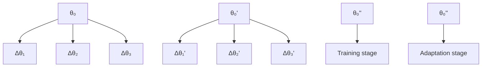

# III. PROBLEM STATEMENT

We consider a general robotic system

$$M (q) \ddot {q} + C (q, \dot {q}) \dot {q} + g (q) = u + d (q, \dot {q}, w) \tag {1}$$

where $q , \dot { q } , \ddot { q } \in \mathbb { R } ^ { n }$ denote the pose, velocity and acceleration vectors, respectively. $M ( q )$ is the symmetric, positive definite mass and inertia matrix, $C ( q , \dot { q } )$ is the Coriolis matrix, and $g ( q )$ is the gravitational force vector. $u \in \mathbb { R } ^ { n }$ is the control input and $d ( q , \dot { q } , w )$ includes all unmodeled disturbances, with w representing unknown environment condition. Given a target trajectory $q _ { d } \in \mathbb { R } ^ { n }$ , our goal is to design a control law u that ensures robot pose $q$ converges to the reference trajectory $q _ { d } .$ , despite the presence of unknown disturbance $d .$

Since the environment condition w is unknown and timevarying, we assume the disturbances d can be approximated by neural network $f$ with robot states $q , \dot { q }$ as input,

$$d (q, \dot {q}, w) \approx f (q, \dot {q}, \theta^ {*} (w)) \tag {2}$$

where $\theta ^ { * } ( w ) \ \in \ \mathbb { R } ^ { p }$ represents the network parameters depending on w, and the network is over-parameterized $( p \gg n )$ . Thus, for each disturbance $d ,$ there exists at least one $\theta ^ { * } ( w )$ such that Eq. (2) holds. Our goal is to design an adaptive law

$$\dot {\theta} = h (q, \dot {q}, u, \theta), \quad \theta (0) = \theta_ {0} \tag {3}$$

where $\theta _ { 0 }$ is the initial network parameter, and the adaptive law $h$ estimates $\theta ^ { * } ( w )$ in real-time, compensating for d to ensure the robot pose converges to the reference trajectory.

flowchart

Fig. 2. Self-supervised meta-learning (SSML) alternates between the adaptation stage and the training stage, pretraining the DNN initial parameter $\theta _ { 0 }$ for rapid online adaptation.

Given the over-parameterization of $f ,$ for all possible environment condition w, we can rewrite Eq. (2) as:

$$d (q, \dot {q}, w) \approx f (q, \dot {q}, \theta_ {0} + \Delta \theta) \tag {4}$$

where $\Delta \theta ( w ) = \theta - \theta ^ { * } ( w )$ denotes the network parameter residual that requires online adaptation. This shows that the quality of the initial DNN parameter $\theta _ { 0 }$ affects the residual $\Delta \theta ,$ , and thus the tracking performance (see Fig. 1(a)).

The goal of pretraining is to find a good initial DNN parameter $\theta _ { 0 }$ that is close to $\theta ^ { * } ( w )$ across all environment conditions $w ,$ thereby minimizing the initial parameter residual $\Delta \theta ( w )$ .
