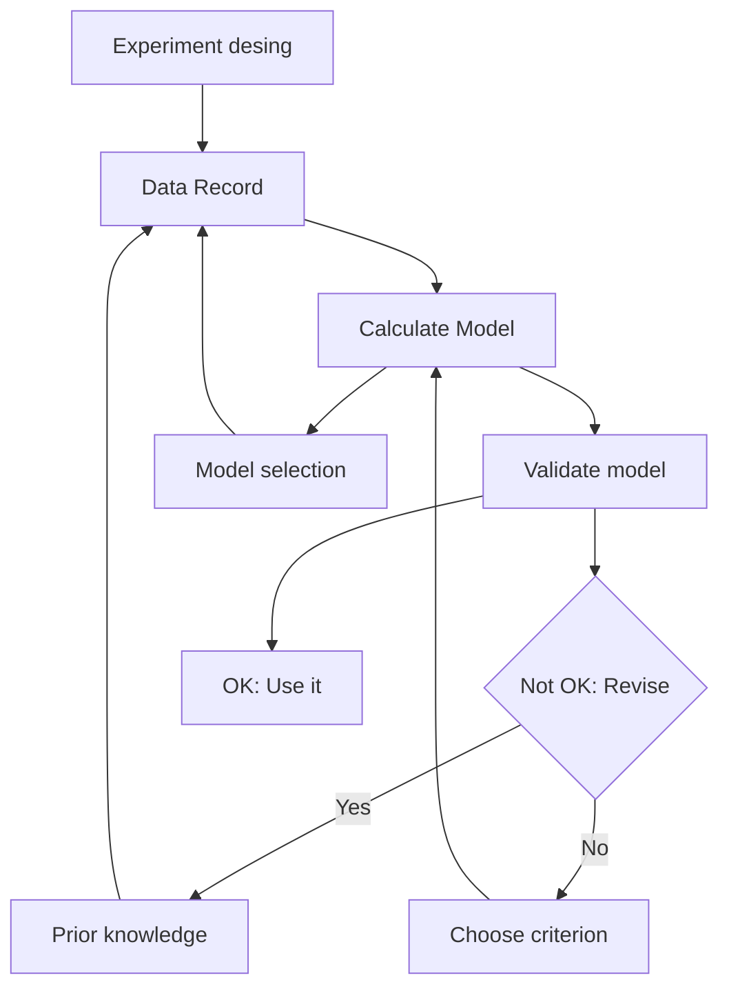

# III. SYSTEM IDENTIFICATION

The flight control system of a multicopter is nonlinear and underactuated, with significant coupling between its degrees of freedom. This dynamic behavior can be effectively approximated using a PD control structure. Forces and torques derived from the Euler-Lagrange method are transformed into control inputs through an optimization-based identification process. Additionally, the nonlinear dynamics are further identified using the SINDy method, which allows for a data-driven discovery of the governing equations, enhancing the predictive capability of the control system.

The state vector x(t) is obtained from the velocity and acceleration measurements collected from the UAV during experimental flights from a DJI MATRICE 100 quadcopter, which features an integrated low-level flight controller.

This approach uses experimental data from real-world tests to system identification, as depicted in Fig 4, involves key steps that guide the development of mathematical models from observed data [20].

flowchart

Fig. 4: System identification process for the UAV.
