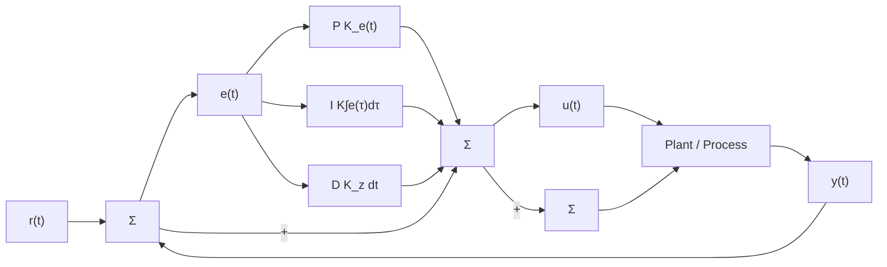

# 2.3 PID CONTROL

Proportional, Integral, and Derivative (PID) control offers a robust method of controlling complex dynamic systems [11]. It relies on calculating the error between a parameter’s setpoint and current value from the plant to inform its output. A block diagram of the PID controller is shown in Figure 3. The performance of the controller can be tuned by adjusting the values of $K _ { p } ,$ $K _ { i } ,$ and $K _ { d } ; K _ { p }$ increases the output proportionally to the error, $K _ { i }$ integrates the error over time to reduce residual error, and $K _ { d }$ checks the rate at which the error is changing to reduce overshoots.

flowchart

Figure 3: PID controller block diagram [12]

The PID controller can be written mathematically, as shown in Equation ( ):

$$u _ {n} (t) \stackrel {\text { def }} {=} K _ {n p} e _ {n} (t) + K _ {n i} \int_ {0} ^ {t} e _ {n} (\tau) d \tau + K _ {n d} \frac {d e _ {n} (t)}{d t} \tag {2}$$
