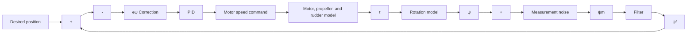

# 3.5 SHIP MODEL

A simple model has been designed and implemented. The ship is modelled as a point in

flowchart

Figure 6: Control loop layout for ??

3D space. It oscillates vertically sinusoidally with user-specified phase, frequency, and amplitude. It translates simultaneously in the horizontal plane with user-specified starting position, heading, and velocity, with the latter two parameters able to change dynamically during the simulation.

Whilst far more sophisticated models are available and documented [2], [17]–[19], the focus of this paper is on the development of a reference-point tracking control system so a simple approximation is sufficient.

A more sophisticated model may account for the variation in wave types across the world, variable velocity and amplitude waves, and the combination of waves from different sources to produce a complex multi-dimensional problem.
