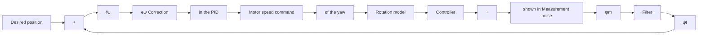

Finally, the controllers shown in equations (30) and (31) determine the torques about the pitch and roll axes:

$$u _ {\theta} (t) \stackrel {\text { def }} {=} K _ {\theta p} e _ {\theta} (t) + K _ {\theta i} \int_ {0} ^ {t} e _ {\theta} (\tau) d \tau + K _ {\theta d} \frac {d e _ {\theta} (t)}{d t} \tag {30}u _ {\phi} (t) \stackrel {\text { def }} {=} K _ {\phi p} e _ {\phi} (t) + K _ {\phi i} \int_ {0} ^ {t} e _ {\phi} (\tau) d \tau + K _ {\phi d} \frac {d e _ {\phi} (t)}{d t} \tag {31}$$

flowchart

Figure 6. Whilst the PID controller takes the same form as normal, the definition of error $e _ { \psi } ( t )$ changes depending on the current state:

$$u _ {\psi} (t) \stackrel {\mathrm{def}} {=} K _ {\psi p} e _ {\psi} (t) + K _ {\psi i} \int_ {0} ^ {t} e _ {\psi} (\tau) d \tau + K _ {\psi d} \frac {d e _ {\psi} (t)}{d t} \tag {32}
e _ {\psi} (t) = \left\{ \begin{array}{c l} \left(f _ {\psi} \text {   mod   } 2 \pi\right) + 2 \pi , & f _ {\psi} \text {   mod   } 2 \pi <   - \pi \\ f _ {\psi} \text {   mod   } 2 \pi , & - \pi \leq f _ {\psi} \text {   mod   } 2 \pi \leq \pi \\ \left(f _ {\psi} \text {   mod   } 2 \pi\right) - 2 \pi , & \pi <   f _ {\psi} \text {   mod   } 2 \pi \end{array} \right. \tag {33}
f _ {\psi} = \psi_ {d} - \psi \tag {34}$$

To explain this logic, consider the situation shown in Figure 7; if the UAV is currently following Heading 1 and the mission profile requires it to change to Heading 2, an uncorrected controller would command an increase in heading to move from 005° to 3 5°, where increasing heading equates to clockwise rotation when viewed from above, i.e., the red path. It is clear that the UAV should take the shorter green path instead.
