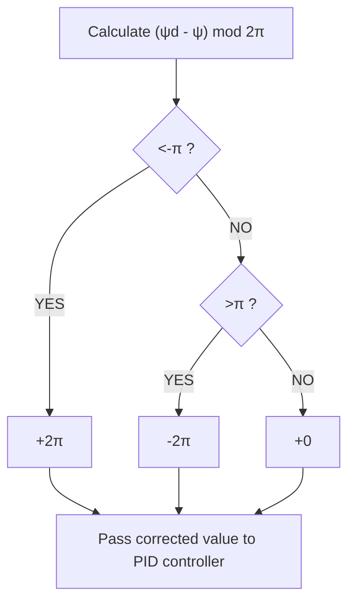

To correct for this, the controller first performs a ?????? function on the error to negate the effect of multiple previous rotations, and output only the current error within the period of one rotation. This result is then checked against the angle of a half-rotation to determine whether it would be more efficient to assume it to be within the next or previous rotational period, rather than the current, and if so, the appropriate adjustment is applied. This process is shown in equations (33) and (3 ), and explained diagrammatically in Figure 8.

text_image

N
Heading 2
345°
Heading 1
015°

Figure 7: The two options for crossing North shown by green and red arrows

flowchart

Figure 8: Flowchart showing the method to correct $\pmb { \psi }$ error to ensure efficient North crossing
