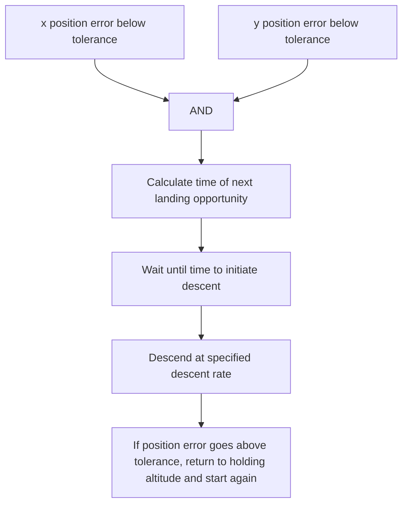

# 3.6.3 LANDING CONTROLLER

A landing controller has been developed to control the descent of the UAV from its holding altitude to the ship.

The function of the landing controller is to time the descent of the quadrotor such that it comes into contact with the ship when the ship is at the peak of a wave, minimising the relative velocity to reduce the risk of damage. The controller has been summarised in Figure 9.

flowchart

Figure 9 : Flowchart showing the logic within the landing controller
