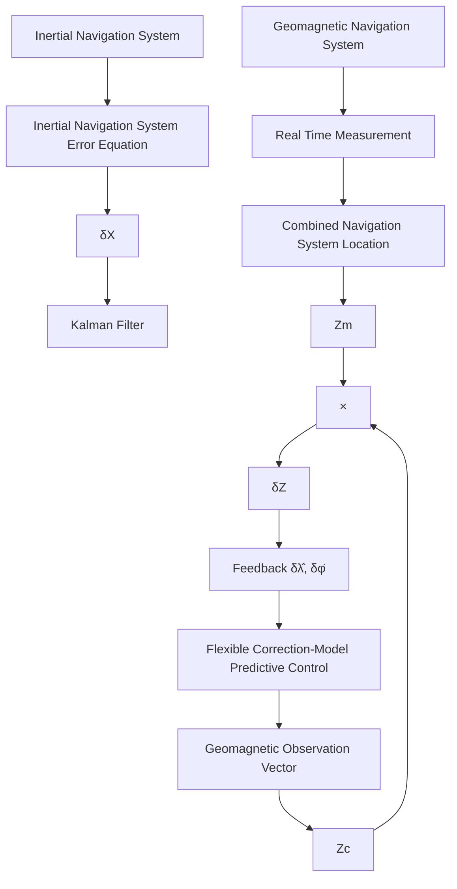

# Graphical Abstractv:

Geomagnetic and Inertial Combined Navigation Approach Basedr on Flexible Correction-Model Predictive Control Algorithma

Xiaohui Zhang, Xingming Li, Songnan Yang, Wenqi Bai, Yirong Lan

flowchart

