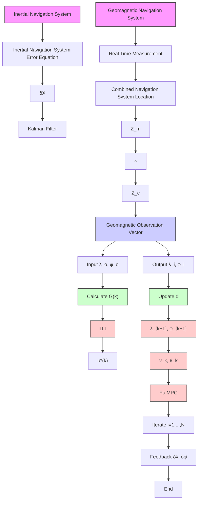

1. To address the challenges of geomagnetic and inertial navigation in GPS-denied environments without prior geomagnetic maps, this paper proposes the Fc-MPC method, which utilizes combined real-time geomagnetic and inertial data for heading correction.   
2. This paper presents a flexible heading correction method designed to address the vulnerabilities of traditional data fusion algorithms to real-

time information errors caused by magnetic storms in combined navigation systems.

3. This paper overlays a geomagnetic anomaly onto the World Magnetic Model model to assess and verify the stability of the combined navigation approach based on the algorithm, specifically the algorithm addressing geomagnetic susceptibility under time-varying interference. Additionally, this algorithm is applied to real navigation systems.

flowchart

Fig. 1. The flowchart of flexible correction-model predictive control algorithm for combined navigation systems.

The remainder of this article is structured as follows: Section 2 introduces the basic theory of geomagnetic navigation and the MPC algorithm for navigation systems. Section 3 proposes a geomagnetic and inertial combined navigation approach based on the Fc-MPC algorithm. Section 4 analyzes and evaluates the performance of the method through various interference simulations and experiments with real data. Finally, Section 5 concludes this work.
