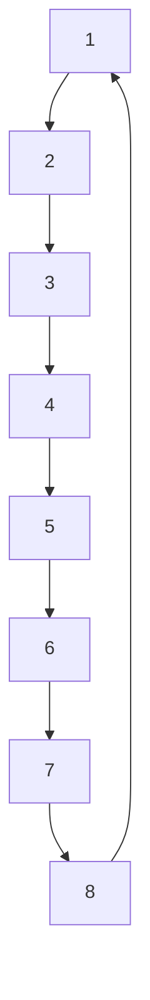
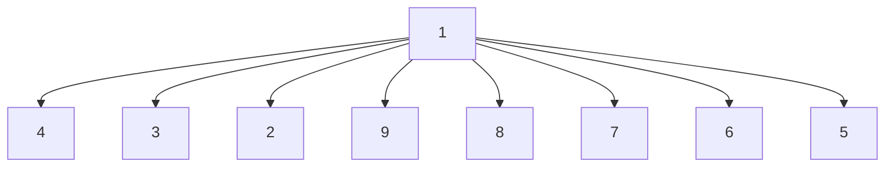
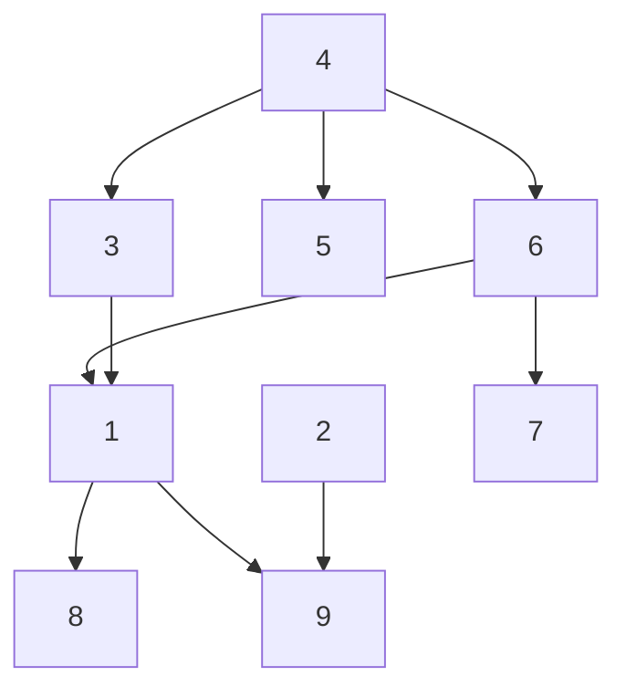

In other words, while solving (1) in a distributed manner, the agents should not gain any local or global insights apart from their individual quantities. Further, (if not desired for an application) the operator should not get any insights into the obtained solution to (1) but should be able to specify the cooperative control task by means of the $\delta _ { i }$ . Achieving these security goals also requires specifying an attacker model. In constraints ???? ?? , solving (1) results innstraints ???? ?? , solving (1) results instraints ???? ?? , solving (1) results inthis work, we assume that the agents are honest-but-curious (semi-honest), i.e., they will faithfully execute computations ??∗??∗??∗and communications prescribed by the protocol but may oth-??∗   (4??∗   (4)??∗   (4)erwise use all information available to them to gain knowl-⎜  ⎟⎜ ⎟⎜ ⎟edge about secret data. We briefly note that the specified se-??⎝ ?? ⎠⎝ ?? ⎠curity goals are more strict than in the existing literature. For for suitable sorting and choices of . We are nr suitable sorting and choices of . We are no suitable sorting and choices of . We are nowinstance, in [28], neighboring agents get access to $\alpha _ { i }$ readeadyadyafter to specify thconvergence.

(a) Ring grapha)   

flowchart

(b) Star graph   

flowchart

(c) Generic gra(c) Generic grap(c) Generic graph(c) Generic graph   

flowchart

1: Exemplary communication graphs. The first two graphs offer specific structures, while the latter is generic.: Exemplary communication graphs. The first two graphs offer specific structures, while the latter is generic.Exemplary communication graphs. The first two graphs offer specific structures, while the latter is generic.Figure 1: Exemplary communication graphs. The first two graphs offer specific structures, while the latter is generic.
