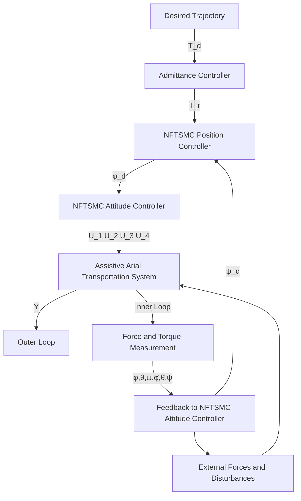

# III. CONTROLLER DESIGN AND STABILITY ANALYSIS

In this section, the controller will be designed to control the assistive payload transportation system with human physical interaction to track human guidance and stabilize the system while transporting the payload in the presence of aerodynamic drag forces and external disturbances. Figure 2 depicts a schematic diagram of the overall control system. The controller will be designed based on a novel combination of the admittance controller for human-aerial vehicle physical interaction and NFTSMC, which is a well-known nonlinear controller in terms of its robustness against modeling uncertainties and external disturbances, as well as fast convergence to ensure system stability [18], [24], [32].

flowchart

Fig. 2: Schematic block diagram of the control system.

For control design purposes, the dynamic model in Equation (8) will be expanded and written in the following form:

$$\ddot {\chi} = F + \delta + b u \tag {16}$$

where $\Ddot { \chi } \ = \ [ \ddot { x } , \ddot { y } , \ddot { z } , \ddot { \phi } , \ddot { \theta } , \ddot { \psi } ] ^ { \top }$ is the vector of the system translational and angular accelerations, ?? and $b \neq 0$ are smooth non-linear functions, and δ represents the uncertainties and external forces and disturbances, and u is the control input.

Assumption 2. δ in Equation (16) is assumed to be bounded and satisfy $\| \delta \| \leqslant \varpi ,$ , where $\varpi > 0 .$ .

Assumption 3. The desired position of the entire system, $X _ { d } = [ x _ { d } , y _ { d } , z _ { d } ] ;$ , is bounded, smooth, and differentiable.

Assumption 4. For small $( \phi , \theta , \psi )$ angles applications such as the system in this work, the Euler angles rate, $\dot { \Theta } = ( \dot { \phi } , \dot { \theta } , \dot { \psi } )$ is assumed to be equal to the angular velocity $\omega = ( p , q , r )$ .
