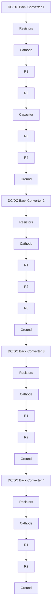
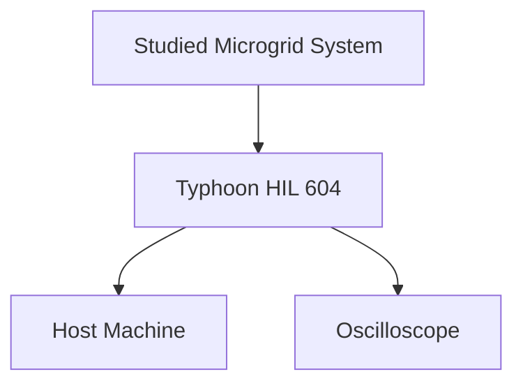

# IV. HARDWARE-IN-THE-LOOP VALIDATION

A low-voltage DC MG, with a structure shown in Fig. 1, is modeled to study the effectiveness of the proposed control methodology. The practical validation of our control protocol and the DC MG model consists of four DC-DC converters emulated on a Typhoon HIL 604 system which showed in Fig. 2, ensuring a high-fidelity replication of real-world scenarios. Each source is driven by a buck converter. The converters have similar typologies but different ratings, i.e., the rated currents are equal to are equal to Irated1,2,3,4 $I _ { 1 , 2 , 3 , 4 } ^ { \mathrm { r a t e d } } = ( 6 , 3 , 3 , 6 )$ $R _ { 1 . 2 . 3 . 4 } ^ { \mathrm { v i r } } = ( 2 , 4 , 4 , 2 )$ besides virtual impedance. The converter parameters are $C = 2 . 2 \mathrm { m F } , \dot { L } = 2$ .64mH, $f _ { s } = 6 0 \mathrm { k H z } , R _ { \mathrm { l i n e } } = 0 . 1 \Omega$ , $R _ { L } = 1 0 \Omega , V _ { \mathrm { r e f } } = 4 8 ~ \mathrm { V }$ , and $V _ { \mathrm { i n } } = 8 0 ~ \mathrm { V }$ . The rated voltage of the DC MG is 48V . The communication network is shown in Fig. 1. Communication links are assumed bidirectional to feature a Laplacian matrix and help with the sparsity of the resulting communication graph.

flowchart

Fig. 1. The tested DC MG physical structure.

In this section, several cases are designed to verify the effectiveness of the proposed controller.

flowchart

Fig. 2. The tested DC MG physical structure built using Typhoon HIL devices.
