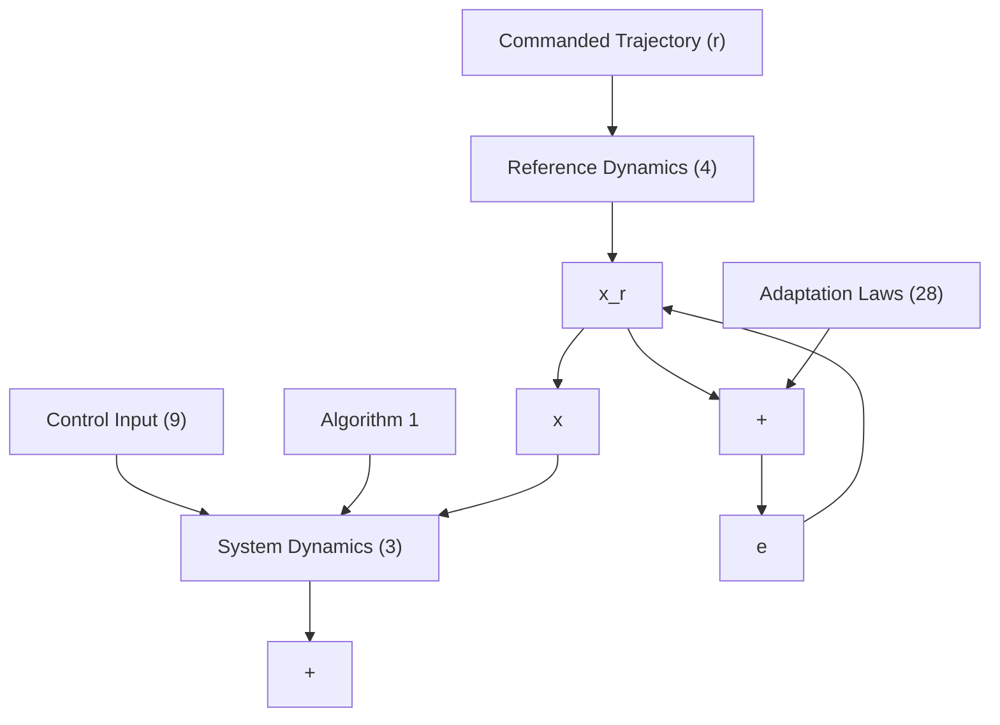

Remark 1. Let Wˆ denotes the online estimate of the ideal parameter W, and $\tilde { \textbf { W } } = \hat { \textbf { W } } - \textbf { W }$ is the estimation error. The memory term with the proposed algorithm is $\left( \mathbf { Y } _ { m } - \hat { \mathbf { W } } ^ { T } \Phi _ { m } \right) ^ { T }$ , from (24) putting $\begin{array} { r } { \mathbf { Y } _ { m } = \mathbf { W } ^ { T } \pmb { \Phi } _ { m } , } \end{array}$ we obtain that the memory term is −W˜ . Therefore, when this memory term is supplied to an update law $\hat { \mathbf { W } }$ , it generates an identity matrix as the coefficient matrix of the estimation error dynamics $\dot { \tilde { \mathbf { W } } }$ . However, we are interested in extracting the system parameters directly, we are not proposing an update law $\hat { \mathbf { W } }$ .

The estimate of the system parameters W are stored in the matrix $\mathbf { Y } _ { m }$ after processing the filtered system data through Algorithm 1 and post-multiplying by $\Phi _ { b } ^ { T } .$ . We propose few transformations of the matrix ${ \bf Y } _ { m }$ to extract the unknown system parameters $\mathbf { A } , k _ { p }$ , and θ.

The following transformations

$$
\begin{array}{l} \mathbf {Y} _ {m} \left[ \begin{array}{c c} \mathbf {I} _ {n \times n} & \mathbf {0} _ {n \times (1 + p)} \end{array} \right] ^ {T} = \mathbf {A}, \\ \mathbf {Y} _ {m} \left[ \mathbf {0} _ {1 \times n} 1 \mathbf {0} _ {1 \times p} \right] ^ {T} = \mathbf {b} k _ {p}, \tag {26} \\ \mathbf {Y} _ {m} \left[ \begin{array}{c c} \mathbf {0} _ {p \times (n + 1)} & \mathbf {I} _ {p \times p} \end{array} \right] ^ {T} = \mathbf {b} k _ {p} \boldsymbol {\theta} ^ {T}, \\ \end{array}
$$

generates the ideal values of the system parameters under the FE condition.

Remark 2. Glushchenko and Lastochkin (2022) extracted the ideal values of the system parameters using DREM. A time-varying gain is proposed to negate the influence of the excitation level on the process. Low excitation levels infer high gains, which is never a desirable property. The proposed algorithm does not depend on the excitation level of the regressor vector hence avoiding the use of time-varying gains. Therefore, the designed method has significantly improved properties than the existing methods.

flowchart

Fig. 1. Block diagram of the closed-loop system.
