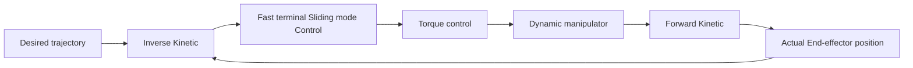

$$u _ {1} = \frac {- f _ {1} (x) - \dot {e} _ {1 x} (\alpha + \beta_ {q} ^ {p} (e _ {1 x}) ^ {\frac {p}{q} - 1})}{g _ {1} (x)} - k _ {1} s g n (S _ {1}) \tag {16}$$

The aim of this paper is to obtain zero trajectory tracking error within a finite reaching time to the sliding surface. Before moving any further, the following assumption is imposed.

\*\*Assumption $1 { : } ^ { * * }$ The matrix $M ( \theta )$ and $C ( \theta , { \dot { \theta } } )$ , along with their derivatives, are bounded.

\*\*Lemma $2 : ^ { * * }$ For any $x \in \mathbb { R } , i = 1 , 2 , \dots , n$ and p as a positive constant [23],

$$\left(| x _ {1} | + \dots + | x _ {n} |\right) ^ {p} < \max \left\{n ^ {p - 1}, 1 \right\} \left(| x _ {1} | ^ {p} + \dots + | x _ {n} | ^ {p}\right). \tag {17}$$

Theorem 1, For the system equation (1), by utilizing equation (9) as the sliding surface, the FTSMC control law is proposed in equation (16), then the system will reach the designed sliding surface in a finite time $t _ { s } ,$ and the trajectory tracking error of the sliding surface will be 0 in finite time $t _ { s } [ \bar { 2 } 4 ]$ .

Proof of Theorem 1: The stability analysis of the FSTM can be discussed as follows:

By selecting a Lyapunov function as:

$$V _ {1} = \frac {1}{2} s _ {1} ^ {2} > 0 \tag {18}$$

The derivation of the proposed Lyapunov function is as follows:

$$
\begin{array}{l} \dot {V} _ {1} = S _ {1} \dot {S} _ {1} = S _ {1} \left(\ddot {e} _ {1} + \dot {e} _ {1} \left(\alpha + \beta \frac {p}{q} (e _ {1}) ^ {\frac {p}{q} - 1}\right)\right) = \\ S _ {1} \left(f _ {1} (x) + g _ {1} (x) \left(u _ {1 e q} + u _ {1 s}\right)\right) \\ + \dot {e} _ {1} \left(\alpha + \beta \frac {p}{q} \left(e _ {1}\right) ^ {\frac {p}{q} - 1}\right) <   0 \tag {19} \\ \end{array}
$$

Then by using equation (19), and the sign function as a switching control law, and substituting in equation (16):

flowchart

Figure 2: Schematic diagram of the close loop system using FTSMC approach
