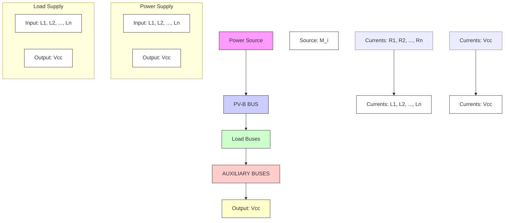

# B. SHS Model of Segment $\mathcal { M } _ { i }$

The state space of $\mathcal { M } _ { i }$ must be derived for all switching scenarios $\alpha \in S$ , separately. Note that, this procedure is done offline and once for each segment which follows the structure of Fig. 2. In this model, the PV-B bus is connected to Bus 1. Also, if any bus $k \in \Pi ^ { i }$ is connected to a neighboring bus $z \in \mathcal { N } _ { i }$ , an auxiliary bus $a _ { k }$ is connected to k accordingly.


<details>
<summary>flowchart</summary>

```mermaid
graph TD
    subgraph (a)
        M1["Module M1"] -->|1| Z12["z12"]
        M1 -->|2| Z24["z24"]
        M1 -->|3| Z13["z13"]
        M1 -->|4| Z25["z25"]
        M1 -->|5| Z14["z14"]
        M1 -->|6| Z26["z26"]
        M1 -->|7| Z15["z15"]
        M1 -->|8| Z27["z27"]
        M1 -->|9| Z16["z16"]
    end
    subgraph (b)
        M2["Module M2"] -->|1| Z03["z03"]
        M2 -->|2| Z04["z04"]
        M2 -->|3| Z05["z05"]
        M2 -->|4| Z06["z06"]
        M2 -->|5| Z07["z07"]
        M2 -->|6| Z08["z08"]
        M2 -->|7| Z09["z09"]
        M2 -->|8| Z0A["z0A"]
        M2 -->|9| Z0B["z0B"]
    end
    (a) --> (b)
```
</details>

Fig. 1. Architecture of the active distribution system.   


<details>
<summary>flowchart</summary>


</details>

Fig. 2. A generic representation of each segment of the distribution system.

Consequently, to consider the dynamics of various buses, the correlated model of $\mathcal { M } _ { i }$ is developed, and its state space model for each scenario α would be
