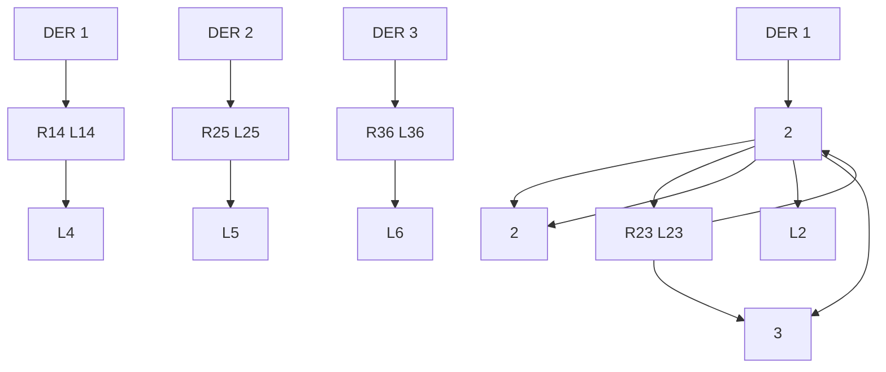

# B. MaMI Design

The conditions of using MaMI for distinguishing the switching scenarios are described theoretically in [10], where the probing input is in the form of

$$u (t) = R u _ {1} (t), \tag {8}$$

where $\begin{array} { r } { U _ { 1 } ( s ) = \mathcal { L } \{ u _ { 1 } ( t ) \} = \frac { b ( s ) } { a ( s ) } , a ( s ) } \end{array}$ and $b ( s )$ are polynomials of s with real coefficients, and the order of $b ( s )$ is strictly less than $a ( s )$ . We consider the step function as $u _ { 1 } ( t )$ that satisfies this condition. For distinguishing different scenarios, the effect of input $u ( t )$ must overcome the unknown initial condition $x ( 0 )$ . To achieve this goal, R must be greater than $R _ { 0 }$ , where $R _ { 0 }$ is defined as

$$R _ {0} = \frac {2 \mu_ {0} \mu_ {1}}{\delta_ {\text { min }}}, \tag {9}$$

Here, $\mu _ { 0 }$ is the upper bound for the norm of the initial condition of the system states.

$$\left| \left| x (0) \right| \right| \leq \mu_ {0}. \tag {10}$$

Due to the physical limitation, the infimum of $\mu _ { 0 }$ must be considered for designing the probing input. The l-inf norm $( | | . | | _ { i n f } = \operatorname* { m a x } \{ . \} )$ serves as the design criterion where, the maximum perturbation of the system states must be chosen as $\mu _ { 0 } .$ Assuming the advanced control mechanisms in PV-B and system voltage, we consider $\mu _ { 0 }$ to represent a small perturbation—approximately 2% of the maximum line or load current in the steady state derived from power flow analysis.

According to [10], $\mu _ { 1 }$ is defined as

$$\max _ {\alpha \in S} \max _ {t \in [ 0, \tau_ {0} ]} | | C (\alpha) \exp^ {A (\alpha) t} | | \leq \mu_ {1}. \tag {11}$$

We assume that unobservable contingencies are minor enough not to cause system instability, as any instability would propagate and be detectable by the existing sensor infrastructure. Thus, $A ( \alpha )$ consists of negative eigenvalues, and $\exp ^ { \ b { A } ( \alpha ) t }$ is monotonically decreasing for $t ~ \in ~ [ 0 , \tau _ { 0 } ]$ ]. Consequently, we have

flowchart

Fig. 3. The PV-B Integrated Distribution System.
