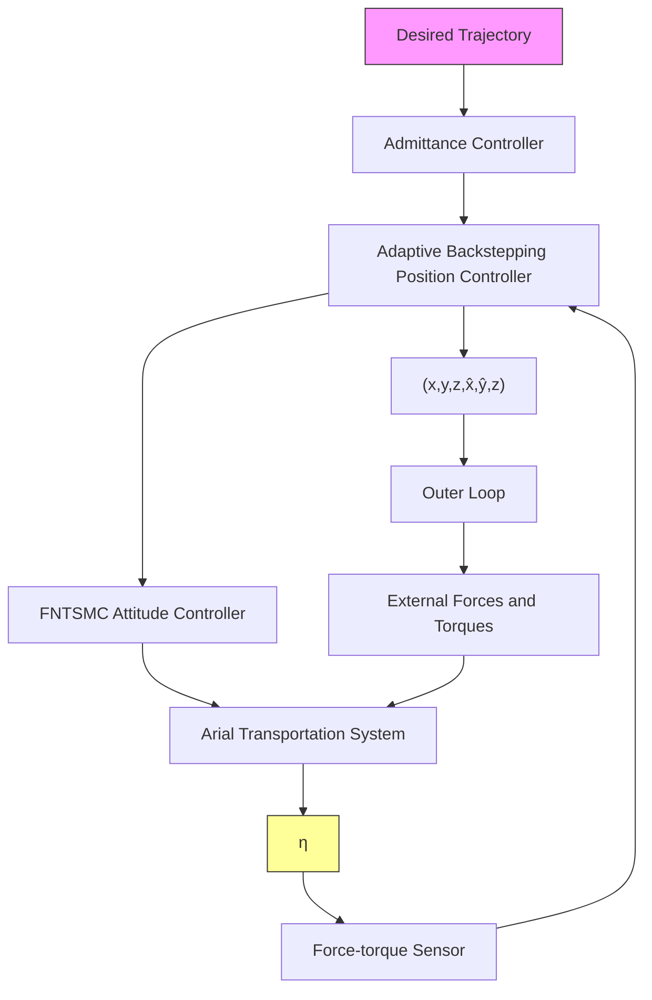

where + represents the pseudo inverse and the optimized solution $\boldsymbol { u } _ { d } ^ { * }$ in (10) satisfies Remark 1.

flowchart

Fig. 2: Illustrative diagram of the proposed control system.
