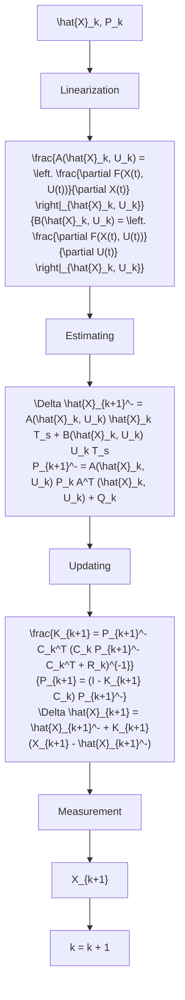

Fig. 2. Block diagram of the Extended Kalman Filter.

Estimating:

$$\Delta \hat {\mathbf {X}} _ {k + 1} ^ {-} = \mathbf {A} (\hat {\mathbf {X}} _ {k}, \mathbf {U} _ {k}) \hat {\mathbf {X}} _ {k} T _ {s} + \mathbf {B} (\hat {\mathbf {X}} _ {k}, \mathbf {U} _ {k}) \mathbf {U} _ {k} T _ {s} \tag {26}\mathbf {P} _ {k + 1} ^ {-} = \mathbf {A} (\hat {\mathbf {X}} _ {k}, \mathbf {U} _ {k}) \mathbf {P} _ {k} \mathbf {A} ^ {T} (\hat {\mathbf {X}} _ {k}, \mathbf {U} _ {k}) + \mathbf {Q} _ {k} \tag {27}$$

Updating:

$$\mathbf {K} _ {k + 1} = \mathbf {P} _ {k + 1} ^ {-} \mathbf {C} _ {k} ^ {T} (\mathbf {C} _ {k} \mathbf {P} _ {k + 1} ^ {-} \mathbf {C} _ {k} ^ {T} + \mathbf {R} _ {k}) ^ {- 1} \tag {28}\mathbf {P} _ {k + 1} = (\mathbf {I} - \mathbf {K} _ {k + 1} \mathbf {C} _ {k}) \mathbf {P} _ {k + 1} ^ {-} \tag {29}\Delta \hat {\mathbf {X}} _ {k + 1} = \Delta \hat {\mathbf {X}} _ {k + 1} ^ {-} + \mathbf {K} _ {k + 1} (\mathbf {Y} _ {k + 1} - \mathbf {C} _ {k} \hat {\mathbf {X}} _ {k + 1} ^ {-})= \Delta \hat {\mathbf {X}} _ {k + 1} ^ {-} + \mathbf {K} _ {k + 1} (\mathbf {X} _ {k + 1} - \hat {\mathbf {X}} _ {k + 1} ^ {-}). \tag {30}$$

The full diagram of EKF can be seen in Figure 2.

Theorem 3.1: Consider an EKF as in (24)-(30), and the following assumptions hold:

1. There are positive numbers $a , c , p _ { 1 } , p _ { 2 }$ such that the following equations are satisfy with all $k \geq 0 :$

$$\left\| \mathbf {A} _ {k} \right\| \leq a \tag {31}\left\| \mathbf {C} _ {k} \right\| \leq c \tag {32}p _ {1} \mathbf {I} \leq \| \mathbf {P} _ {k} ^ {-} \| \leq p _ {2} \mathbf {I} \tag {33}p _ {1} \mathbf {I} \leq \| \mathbf {P} _ {k} ^ {+} \| \leq p _ {2} \mathbf {I}. \tag {34}$$

2. $\mathbf { A } _ { k }$ is nonsingular with all $k \geq 0$

then the EKF is an exponential observer, and the observer error $\boldsymbol { \epsilon } = \mathbf { X } _ { k } - \hat { \mathbf { X } } _ { k }$ will be bounded.

Proof 3.1: Following the definition of $\mathbf { A } _ { k }$ in the Appendix, and due to $\mathbf { C } _ { k } = \mathbf { I } ,$ the assumption above will be held. The proof of the EKF’s stability can be found in [35], [37].
