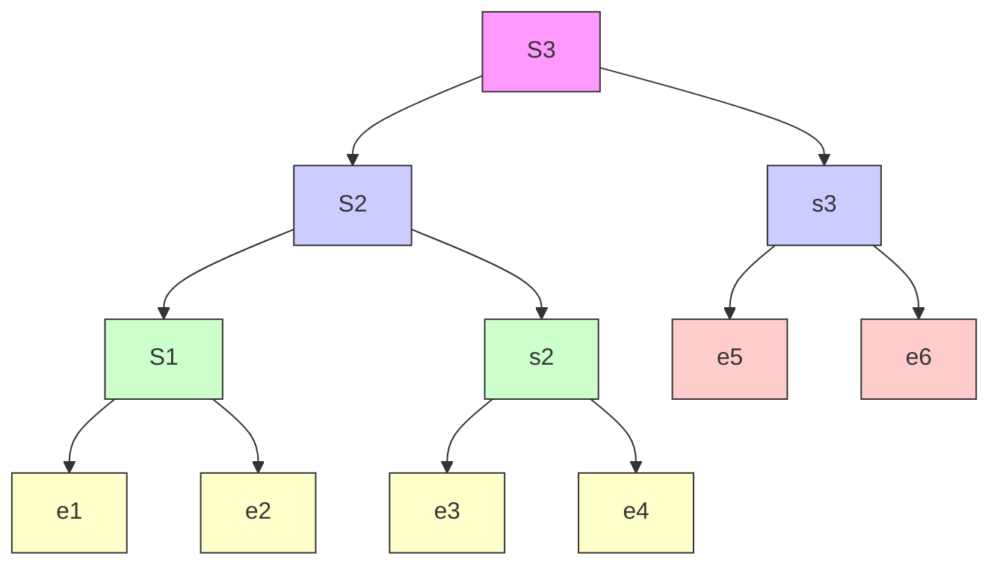

# B. HSMC position controller for UAVs

In this part, we propose three types of HSMC: Aggregated HSMC (AHSMC), Incremental HSMC (IHSMC), and Combining HSMC (CHSMC). Inspired by the idea in [40], the HSMC is designed for three class variables $x , y , z$ with one control input $F _ { z }$ . Its state space expression is represented by:

$$
\left\{ \begin{array}{l} \dot {x} _ {2 i - 1} = x _ {2 i} \\ \dot {x} _ {2 i} = f _ {i} + b _ {i} u \end{array} \right. \tag {51}
$$

where $i = { 1 , 2 , 3 } ,$ and $u = F _ { z }$ .

flowchart

Fig. 3. Structure of AHSMC.

1) Aggregated HSMC: The basic idea of AHSMC is to pair two variable states as a lower layer, and the higher layer considering the lower layers. The structure of AHSMC is depicted in Figure 3. The lower layer is defined as follows:

$$s _ {1} = c _ {1} e _ {1} + e _ {2} \tag {52}s _ {2} = c _ {2} e _ {3} + e _ {4} \tag {53}s _ {3} = c _ {3} e _ {5} + e _ {6} \tag {54}$$

where $c _ { 1 } , c _ { 2 } , c _ { 3 }$ are positive numbers, $e _ { 1 } = \hat { x } { - } x _ { r } , e _ { 2 } = \dot { \hat { x } } { - } \dot { x } _ { r } ,$ $e _ { 3 } = \hat { y } - y _ { r } , e _ { 4 } = \dot { \hat { y } } - \dot { y } _ { r } , e _ { 5 } = \hat { z } - z _ { r } , e _ { 6 } = \dot { \hat { z } } - \dot { z } _ { r }$ are control errors.

The higher layers are defined as:

$$S _ {1} = s _ {1} \tag {55}S _ {2} = \lambda_ {1} S _ {1} + s _ {2} \tag {56}S _ {3} = \lambda_ {2} S _ {2} + s _ {3} \tag {57}$$

where $\lambda _ { 1 } , \lambda _ { 2 }$ are control parameter. The equivalent controller that makes the sliding surface’s derivative equal to zero is calculated based on:

$$\dot {s} _ {1} = c _ {1} \dot {e} _ {1} + \dot {e} _ {2} = c _ {1} (\dot {\hat {x}} - \dot {x} _ {r}) + (\ddot {\hat {x}} - \ddot {x} _ {r})= c _ {1} (\dot {\hat {x}} - \dot {x} _ {r}) + (f _ {\hat {x}} + b _ {\hat {x}} u - \ddot {x} _ {r}). \tag {58}$$

Therefore the equivalent control law for sliding surface $s _ { 1 }$ is chosen as:
