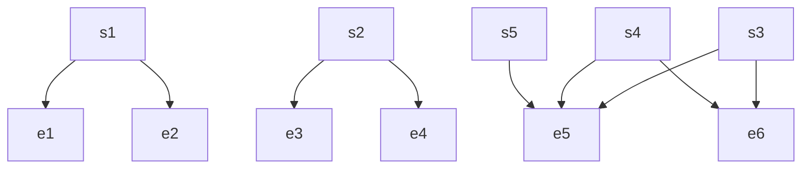

$$
\begin{array}{l} \dot {V} _ {a} = S _ {3} \left\{\lambda_ {1} \lambda_ {2} \left[ c _ {1} (\dot {\hat {x}} - \dot {x} _ {r}) + \left(f _ {\hat {x}} + b _ {\hat {x}} u - \ddot {x} _ {r}\right) \right] \right. \\ + \lambda_ {2} [ c _ {2} (\dot {\hat {y}} - \dot {y} _ {r}) + (f _ {\hat {y}} + b _ {\hat {y}} u - \ddot {y} _ {r}) ] \\ \left. + c _ {3} (\dot {\hat {z}} - \dot {z} _ {r}) + (f _ {\hat {z}} + b _ {\hat {z}} u - \ddot {z} _ {r}) \right\} \\ = S _ {3} \bigg [ \lambda_ {1} \lambda_ {2} b _ {\hat {x}} (u _ {e q y} + u _ {e q z} + u _ {s w}) + \lambda_ {2} b _ {\hat {y}} (u _ {e q x} \\ \left. + u _ {e q z} + u _ {s w}) + b _ {\hat {z}} (u _ {e q x} + u _ {e q y} + u _ {s w}) \right] \\ = - K _ {a} S _ {3} ^ {2} - \eta S _ {3} \operatorname{sat} \left(S _ {3}\right). \tag {66} \\ \end{array}
$$

Hence, the sliding surface is stable. Moreover, applying Barbalat’s lemma [39], the sliding surface will converge to zero. Since the sliding surface $S _ { 3 }$ is asymptotically stable from the time domain $[ 0 , t _ { f } ]$ , the stability of sliding surface $S _ { 1 } , S _ { 2 }$ can be archived in the time domain $[ t _ { f } , \infty ]$ . The proof of this stability is in [40].

flowchart

Fig. 4. Structure of IHSMC.

2) Incremental HSMC: The idea of IHSMC is to add an additional state into each layer. Without the loss of generality, the first layer is the construction of control error along $x _ { 1 }$ , x2 variables, and the higher layer takes control error of the next variable state. As a result, the structure of IHSMC is depicted in Figure 4. The sliding surface of the IHSMC is designed as:

$$s _ {1} = c _ {1} e _ {2} + e _ {1} \tag {67}s _ {2} = c _ {2} e _ {3} + s _ {1} \tag {68}s _ {3} = c _ {3} e _ {4} + s _ {2} \tag {69}s _ {4} = c _ {4} e _ {5} + s _ {3} \tag {70}s _ {5} = c _ {5} e _ {6} + s _ {4} \tag {71}$$

where $c _ { 1 } , c _ { 2 } , c _ { 3 } , c _ { 4 } , c _ { 5 }$ are positive numbers, and the error $e _ { i , i = 1 - 6 }$ is defined as the same of the AHSMC.

Theorem 4.2: In the view of Assumption 1, considering the quadrotor UAVs with the state space (36), if the IHSMC controller is proposed as:

$$u = u _ {e q} + u _ {s w} \tag {72}$$

where $u _ { e q } , u _ { s w }$ are the equivalent control law and switch control law, respectively, then the sliding surface $s _ { 5 }$ is asymptotically stable.
