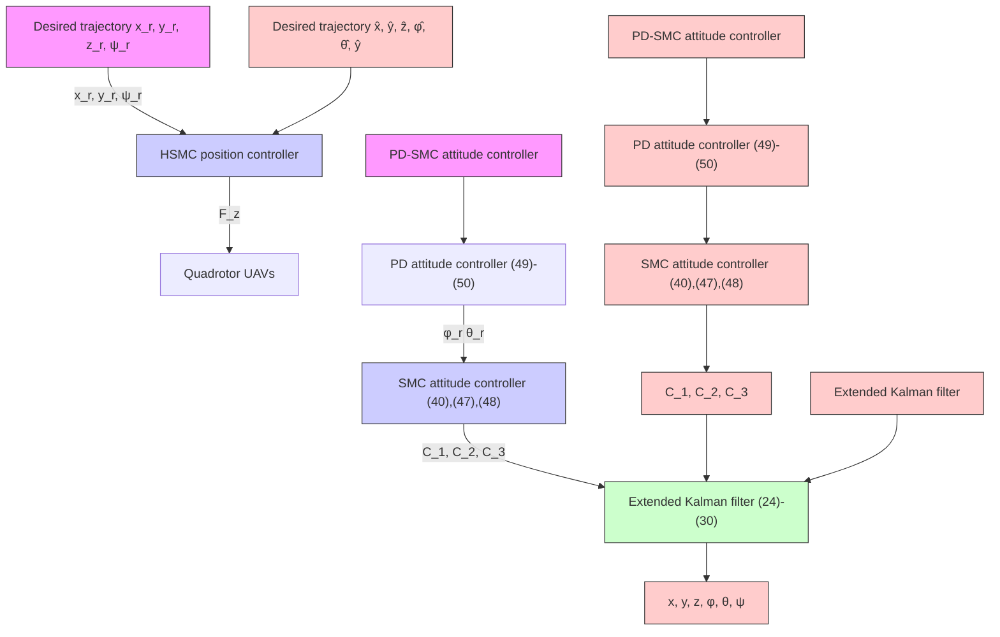

3) Combining HSMC: The idea of the CHSMC is to divide the system state into two parts: the derivative combination and the linear combination. The structure of CHSMC is depicted in Figure 5, where s represents the linear combination, and s˙ represents the derivative combination. The element sliding surface of the CHSMC is proposed as:

flowchart

Fig. 6. Close-loop control structure of the proposed method.

$$s = c _ {1} e _ {1} + c _ {2} e _ {3} + c _ {3} e _ {5}\dot {s} = c _ {1} e _ {2} + c _ {2} e _ {4} + c _ {3} e _ {6} \tag {78}$$

where $c _ { 1 } , c _ { 2 } , c _ { 3 }$ are control parameters, and the control error is defined as the same as the AHSMC and the IHSMC. The CHSMC sliding surface is proposed as:

$$S _ {c} = \alpha s + \dot {s}. \tag {79}$$

Theorem 4.3: In the view of Assumption 1, considering the quadrotor UAVs with the state space (36), if the CHSMC controller is proposed as:

$$u = u _ {e q} + u _ {s w} \tag {80}$$

where $u _ { e q } , u _ { s w }$ are the equivalent control law and switch control law respectively, then the sliding surface $S _ { c }$ is asymptotically stable.

Proof 4.3: According to Lyapunov’s stability, considering the Lyapunov candidate as:

$$V _ {c} = \frac {1}{2} S _ {c} ^ {2}. \tag {81}$$

Differentiating $V _ { c }$ with respect to time t:
