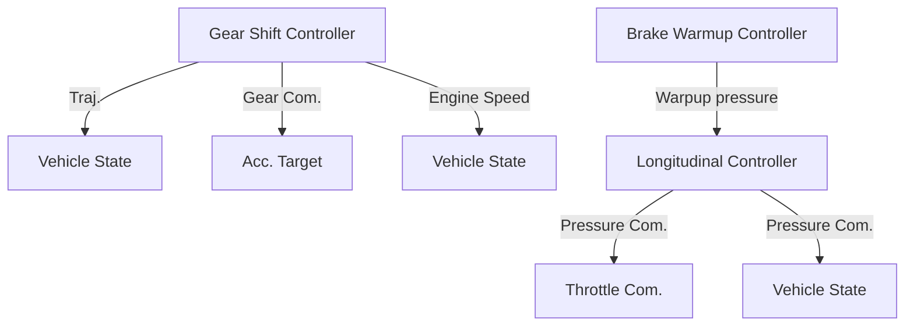

# II. RELATED WORK

Multiple publications address the issue of longitudinal control of vehicles. This includes both pure longitudinal controllers [6]–[8], and combined control of lateral and longitudinal motions [9]–[13]. Paden et al. [14] and Betz et al. [15] provide a comprehensive overview of diverse control concepts applicable to urban and racing scenarios, respectively. However, these methods provide only high-level control commands.

The different trajectory- and path-tracking control concepts include classic approaches such as proportional control [7], slip angle-based control [8], and model predictive control [9]–[13]. These control approaches produce a driving torque [6], [10], [13], longitudinal force [7]–[9], [12] or longitudinal acceleration [11] as control commands. These must be translated to brake pressure, throttle, and gear. Furthermore, none of the approaches account for the varying friction coefficients of tires or brake discs or drag torque introduced by a combustion engine.

The Autoware Foundation offers a vehicle interface that maps a high-level acceleration command to low-level commands needed to control a real-world car. This interface includes a state machine that checks command ranges and oscillations but does not specify how to match the high-level command to a brake pressure and throttle command. Additionally, it assumes the presence of an automatic gearbox and does not support manual gear changes [16], [17].

flowchart

Fig. 2: Structure of the longitudinal control system
