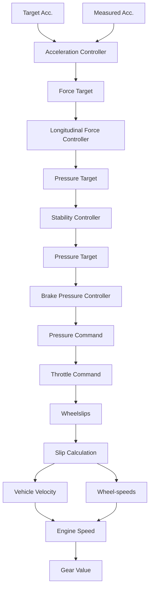

# C. Longitudinal Controller

The longitudinal controller converts an acceleration or force into a throttle and brake command, ensuring accurate acceleration tracking and vehicle stability. The internal structure of the longitudinal controller and its subcomponents is depicted in Fig. 4.

The acceleration controller compares the measured acceleration and an acceleration target produced by an arbitrary trajectory-tracking controller and generates a longitudinal force target. The longitudinal force controller converts this force target to brake pressure and throttle targets using the currently engaged gear and engine speed. The stability controller adjusts these brake pressure and throttle targets to ensure vehicle stability. To achieve this, the stability controller receives the current wheel slips from the slip calculation component. This computes the current wheel slips based on the vehicle’s dynamic state and the individual wheel speeds. The adjusted throttle value is used directly as a command. At the same time, the brake pressure controller processes the brake pressure target along with the measured brake pressure to generate the final brake command.

flowchart

Fig. 4: Internal structure of the longitudinal controller

1) Acceleration Controller: The acceleration controller consists of a feedforward control and a feedback PID control part. The feedforward part generates a target force,

$$F _ {x, \text {target}} = \left(m + \frac {J _ {\text {drivetrain}}}{r _ {\text {wheel} , r} ^ {2}}\right) a _ {x, \text {target}} + F _ {\text {aero}} + F _ {\text {roll}}, (1)$$
