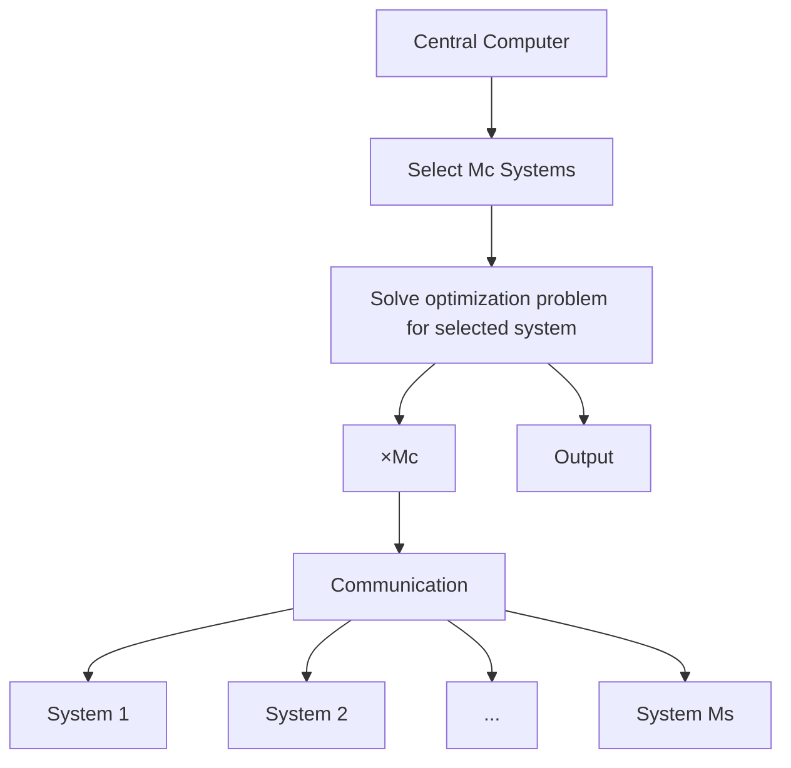

# I. INTRODUCTION

Model predictive control (MPC) is a state-of-the-art technique to control non-linear systems with guaranteed constraint satisfaction and stability [1]. However, MPC needs to solve an optimization problem at every time step, demanding a lot of computation power that often surpasses the system’s resources available locally. One approach to address this challenge is external processing, where the system transmits its state to a central computer, such as an industrial or cloud server, which solves the optimization problem and returns the control input [2]. In this setup, the central computer usually serves multiple systems at once. However, this requires the central computer hardware to solve the optimization problems for all connected systems concurrently, which results in a high computational load.

Event-triggered MPC (ET-MPC) addresses this challenge by only solving the optimization problem when a condition is met, e.g., when the distance between the actual and

This work was supported by the German Research Foundation (DFG) within the priority program 1914 (grant TR 1433/2). The authors gratefully acknowledge the computing time provided to them at the NHR Center NHR4CES at RWTH Aachen University (project number p0022034). This is funded by the Federal Ministry of Education and Research, and the state governments participating on the basis of the resolutions of the GWK for national high performance computing at universities.

RWTHgpt (GPT4) has been used to assist with language editing.

Alexander Gräfe and Sebastian Trimpe are with the Institute for Data Science in Mechanical Enginnering, Faculty of Mechanical Engineering, RWTH Aachen University, 52068 Aachen, Germany alexander.graefe@dsme.rwth-aachen.de, trimpe@dsme.rwth-aachen.de

flowchart

