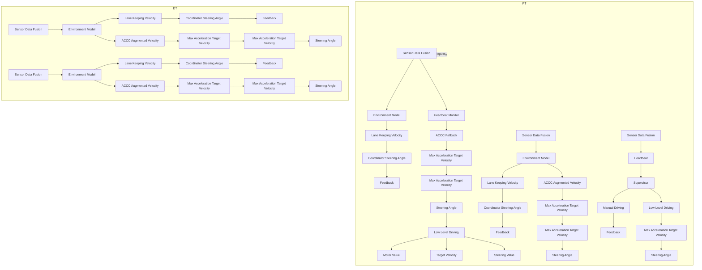

# 3.4 Test Results

The experimental results obtained using the fortissimo rover case-study are presented in the following paragraphs, demonstrating the feasibility of the proposed approach.

flowchart

(a)

line

| Time | Heartbeat |
| --- | --- |
| 08:36:39 | 400 |
| 08:37:29 | 500 |
| 08:38:19 | 600 |
| 08:39:10 | 600 |
| 08:40:00 | 600 |
| 08:40:49 | 600 |
| 08:41:39 | 600 |

