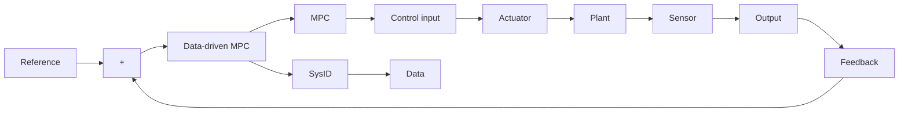

D-MPC offers several advantages over conventional MPC schemes. It utilizes available experimental or industrial data, eliminates the need for a first-principle model, and provides adaptive and robust control solutions that are computationally efficient. The general block diagram of a D-MPC implementation is given in Fig. 1. In a typical D-MPC implementation, dynamic models identified from input-output data using SysID methods are employed to predict the system response over a finite prediction horizon. These approaches, where model identification is the key step, are called model-based D-MPC. Recently, model-free D-MPC schemes have also been introduced in which the data is directly provided to the MPC, bypassing the SysID step (in Fig. 1), and the MPC computes the control input [7, 8].

flowchart

Figure 1: Data-driven MPC block diagram.

As these approaches directly compute the control input from data and do not rely on explicit system models, they are often referred to as direct D-MPC. Based on the nature of the model used for prediction, D-MPC schemes can be grouped into the following classes:

1. Data-driven Linear MPC (D-LMPC): deals with identifying a linear model from data, which is then used for designing an LMPC scheme. The optimization problem for D-LMPC is normally a quadratic programming problem and will be convex.   
2. Data-driven Nonlinear MPC (D-NMPC): deals with identifying a nonlinear model from data, which is then used for designing an NMPC scheme. The optimization problem for D-NMPC is normally a nonlinear programming problem and will be non-convex.
