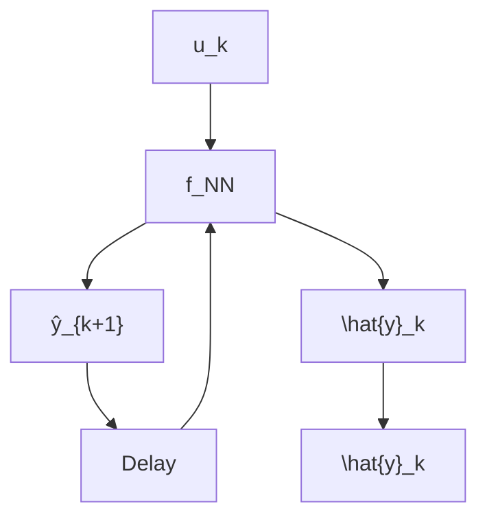

# 4 Data-driven Nonlinear MPC

Data-driven NMPC (D-NMPC) is used for controlling systems that are nonlinear and have a wide operating range so that a linear model is not sufficient for accurately predicting the output. In D-NMPC, the system and output functions f and h in Eq. (26) are considered to be unknown; instead, an input-output sequence $\mathbf { U } _ { \mathrm { D } } , \mathbf { Y } _ { \mathrm { D } }$ as in Eq. (33) is available. Most of the existing model-based D-NMPC schemes are using PEM, i.e., PEM-based SysID followed by NMPC. In the rest of the paper, we discuss PEM-based D-NMPC and its numerical implementation, where we focus on neural network (NN) based models:

1. Recurrent neural network (RNN): is a neural network-based input-output dynamic model. The recurrent (or feedback) connections with delay make RNN a dynamic model and can be represented as a difference equation. (See Fig. 6(a)).   
2. State-space neural network (SSNN): is a data-driven state space model in which the state and output functions are approximated using NNs (See Fig. 6(b)). SSNN comes under the class of RNNs.


<details>
<summary>flowchart</summary>


</details>

(a)


<details>
<summary>flowchart</summary>

```mermaid
graph LR
    u_k["u_k"] --> f_NN["f_NN"]
    f_NN --> x_{k+1}[x_{k+1}]
    x_k --> Delay["Delay"]
    Delay --> f_NN
    f_NN --> h_NN["h_NN"]
    h_NN --> y_hat["ŷ_{k+1}"]
    x_k --> Delay
```
</details>

Figure 6: Block diagram: (a) RNN (b) SSNN [18].
