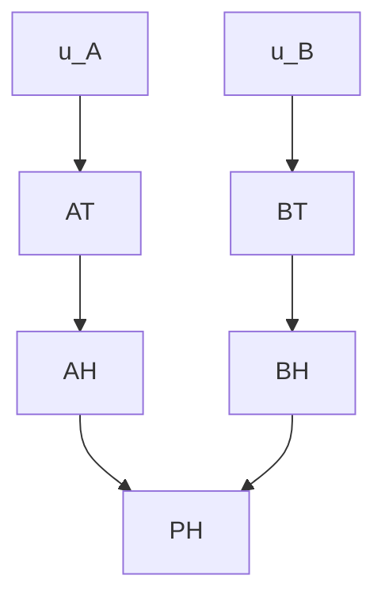

Furthermore, the types of causal models to which Halpern and Pearl restrict their definitions are called strongly recursive. In essence, a causal model is strongly recursive, which for each endogenous variable, a context ⃗u $\in \mathcal { R } ( \mathcal { U } )$ plays a role in defining its value. More specifically, the context helps defining the value of a subset of the endogenous variables, which, in turn, will be used in conjunction with the functions in $\mathcal { F }$ to determine the value of the remaining endogenous variables.

In our discrete example, the context (which encompasses the route that each vehicle is following) comprises the variables $u _ { A } \in \mathcal { U }$ and $u _ { B } \in \mathcal { U }$ . They represent the routes that vehicle A and B are following, respectively. They assume the value 1 if the respective vehicle is following a route that takes a right turn at the junction and 0 otherwise. In such a case, we can define the functions in $\mathcal { F }$ as follows.

$\bullet F _ { A T } ( \vec { u } , B T , A H , B H , P H ) = u _ { A }$   
• FBT (⃗u, AT, AH, BH, P H) = uB   
$\bullet F _ { A H } ( \vec { u } , A T , B T , B H , P H ) = \left\{ \begin{array} { l l } { { 0 , } } & { { A T = 1 } } \\ { { 1 , } } & { { A T = 0 } } \end{array} \right.$   
$\bullet F _ { B H } ( \vec { u } , A T , B T , A H , P H ) = \left\{ \begin{array} { l l } { { 0 , } } & { { A T = 0 } } \\ { { 1 , } } & { { A T = 1 \wedge B T = 0 } } \end{array} \right.$   
$\bullet F _ { P H } ( \vec { u } , A T , B T , A H , B H ) = \left\{ \begin{array} { l l } { { 0 , } } & { { A H = 0 \wedge B H = 0 } } \\ { { 1 , } } & { { A H = 1 \vee B H = 1 } } \end{array} \right.$

In summary, the context considers the particular route that the cars are following, which dictates whether they will turn right or not $( \mathrm { i . e . , } A T$ and BT ). Then, these variables affect AH and BH, and those, in turn, affect $P H$ , as defined in the functions $( \mathcal { F } )$ above.

In Figure 2, we display the causal graph of this example, in which the nodes (representing variables) that have a direct impact on each other are connected by an edge.

flowchart

Figure 2: Causal graph of the AT/BT example.
