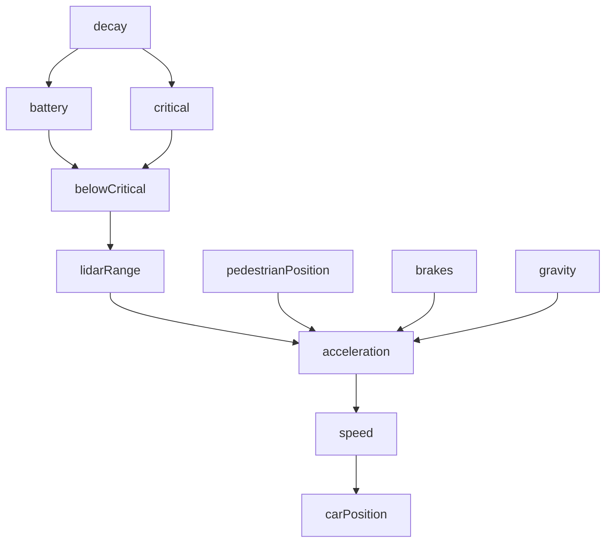

Moreover, in our work, we assume that two properties always hold: the system must be deterministic and the causal model must be acyclic. We only consider deterministic systems since causal models are not achievable for non-deterministic systems; it would not be possible to define functions in F if variables could assume different values given the exact same parameter values. Furthermore, the dependency among endogenous variables in a causal model cannot be cyclic. That is, if the value of a variable X affects a variable Y , then the opposite must not be true. Otherwise, when applying interventions to an endogenous variable X, that would effect changes in Y and this, in turn, would result in further changes to X, which would conflict with the specific intervention that is being applied. This way, a cause could not be determined (as formalised in the sequel in Definition 18). This would result in some restrictions in systems that are inherently cyclic (e.g., with feedback loops) as only some specific combinations of endogenous variables are allowed. To mitigate this issue, we build causal models by splitting the system variables (e.g., speed) into slices and each slice corresponds to a causal variable (e.g., speed1, speed2,...,speedn). Then, causes and effect are determined with respect to these slice variables. Figures 7 and 8 depict what would be causal model for the running example with and without using slices. Note how the cyyclic dependency between the variables acceleration, speed, and carP osition is removed; with this causal mode, variables in the nth slice only affect the variables in the nth + 1 slice. This results in the causal model being an abstraction of the real system, but for the purposes of verification, this suffices to determine actual causality given a sound implementation.

flowchart

Figure 7: Cyclic causal graph of the running example.
