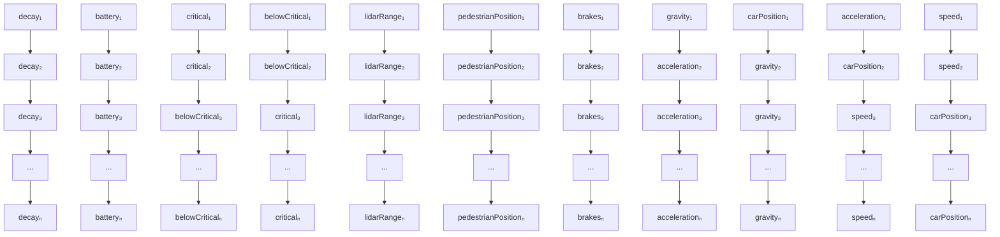

Moreover, most cyber-physical systems comprise a large number of variables and, thus, defining all these variables as endogenous would render the analysis very costly in practice. Hence, in this work, the distinction between endogenous and exogenous variables depends on the feasibility and willingness to modify their values and assess causality. Hence, the best way to utilise this strategy require some knowledge about the system. Examples will be given throughout the paper to demonstrate this.

Example 3 (Endogenous and exogenous variables). Consider the autonomous vehicle example given in Section 3.2.1 and the hazard faced by the pedestrian and that the system is split into two slices. A possible choice of sets for endogenous and exogenous variables can be the following:

flowchart

Figure 8: Acyclic causal graph of the running example.
