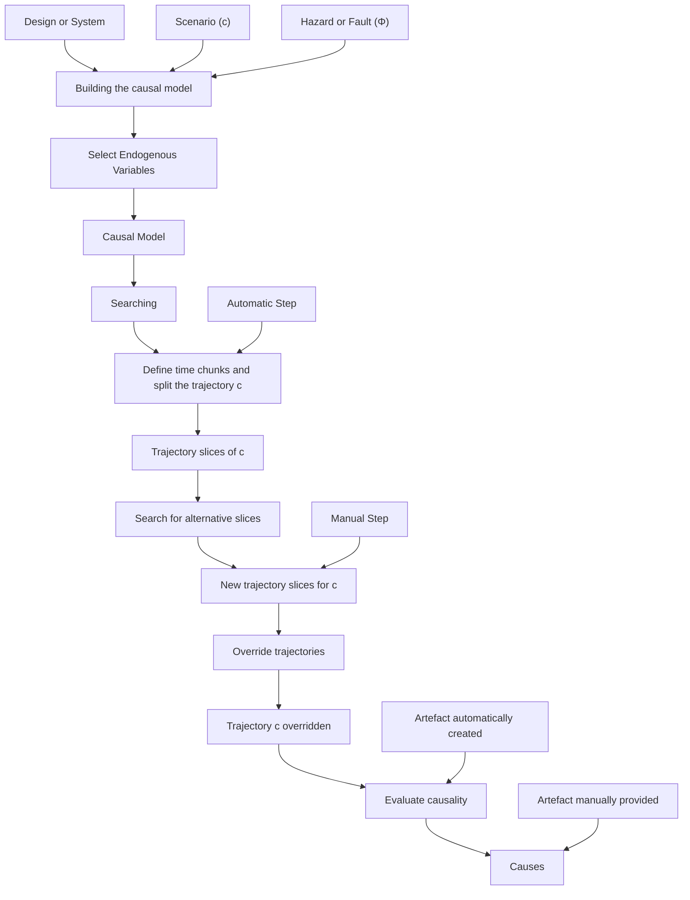

flowchart

Figure 10: Causality process.

4. The search commences by automatically splitting the trajectory c (2 time intervals, initially) and therefore dividing it into smaller (and still continuous) trajectory slices.   
5. The search finds new trajectory slices and then these are used to override c to look for violations of Φ. R is updated on-the-fly.   
6. Causality assessment is performed. If a cause is found, the time intervals are reduced to increase precision.   
7. If a maximum number of trajectory intervals has been explored, then the process stops. Otherwise, the search continues with a finer granularity of time intervals.

The first stage is to build a causal model. It is important to emphasise that, in a practical setting, our causal models are an approximation of the complex interactions of the physical system. Thus, there are some simplifications in the way that the causal models are built.

• In our theory, every variable that is influenced by the system should be classified as endogenous. However, in our practical causal models, having too many endogenous variables would render the analysis very lengthy and costly. Thus, we leave the choice of endogenous variables to the user’s discretion and to what they may want to analyse as cause.
