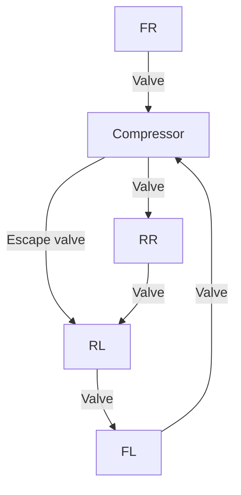

# 6.2 Case study #1: verifying a suspension system

In this first case study, we examine an automotive pneumatic suspension system [52]. We make use of results from a previous experiment [8], in which the faults were manually inserted in the system via a mutation process and detected using Hyconf. The purpose here is to confirm whether our analysis can detect their causes and assist with the correction of such faults. The system’s goal is to increase driving comfort by adjusting the chassis level to compensate for road disturbances. This is achieved by a suspension system that connects the valves attached to each wheel to a compressor and an escape valve (see Figure 16a).

flowchart

FR: front right wheel   
FL: front left wheel   
RR: rear right wheel   
RL: rear left wheel   
(a) Suspension system overview.

text_image

otu
+ 
itu
oti
iti
itl
sp
-
otl

(b) Tolerance levels.   
Figure 16: Suspension system.

The system aims to keep the chassis level as close as possible to a defined set point in each of the four wheels. The decision to increase or decrease the chassis level is based on the tolerance intervals defined for each wheel, as depicted in Figure 16b. We consider [sp−otl, sp+otu] and [sp−itl, sp+itu] as the outer and inner tolerance intervals, respectively. Here, sp represents the set point, which is the target value of the chassis level, and itu, itl, otu and otl represent the inner and outer tolerance thresholds along with their respective upper and lower values. Table 4 displays the variables in the system.
