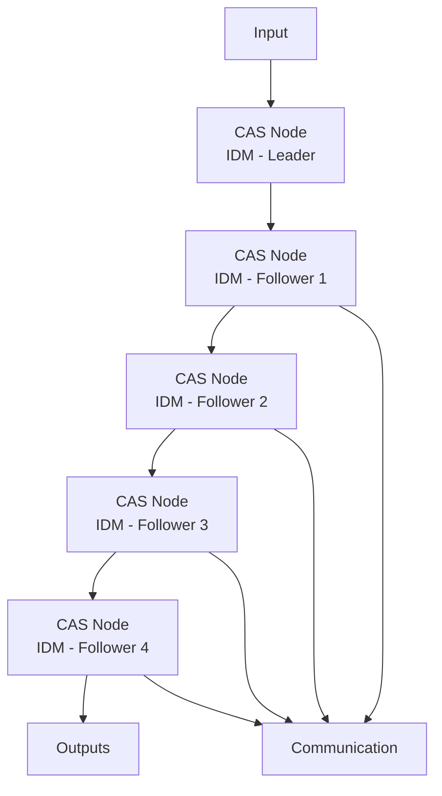

The current model only takes longitudinal movement of the vehicle into account. We assume that the platoon moves along a very long highway without any drastic changes in direction. The main input of our testing campaign is the behaviour of the human driver in the lead vehicle (i.e., its acceleration). Once this input is generated and provided to the lead vehicle, then, via V2V communication, the convoy of followers must autonomously adjust their behaviour to match the vehicle in front. The other inputs to our algorithms are the design-space parameters of the CAS protocol: by automatically searching through the design space, we explore the effect of these parameters on the safety and the quality of the platoon behaviour.

flowchart

Figure 19: Platooning communication diagram [9].
