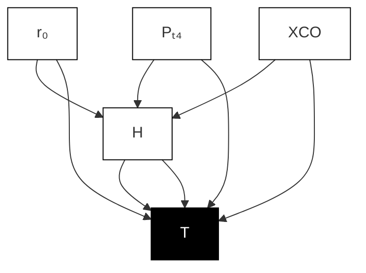

# B. Thrust Estimation using Artificial Neural Networks

This work considers a hypothetical supersonic platform with limited on-board sensing that measures altitude $H ,$ , total combustor pressure $P _ { t 4 }$ , and the combustor exhaust composition of carbon monoxide $X _ { C O }$ . Carbon monoxide is chosen due to the extensive study of insitu combustor measurement through tunable diode laser absorption spectroscopy [41], [42]. Additionally, feedback of the cowl radius, $r _ { 0 } ,$ , state is available for thrust estimation.

An ANN is trained to estimate the thrust from the limited on-board sensors. The neural network architecture is defined according to a sensitivity study of hyperparameters that evaluates the ANN’s performance. The final model architecture, schematically drawn in Figure 2, is composed of 1 hidden layer composed of 20 neurons. The input is the available on-board measurements and the output was the estimated thrust.

flowchart

Fig. 2. Final artificial neural network architecture diagram (Case NNA)

The ANN model was trained using the open-source TensorFlow [43] library. The ANN was trained across a range of altitude from 10 to 40 km and across the full range of possible $r _ { 0 }$ and $r _ { 3 }$ provided in Table II.

TABLE III SUMMARY OF ANN HYPERPARAMETER SENS ITIVITY STUDY

<table><tr><td>Case</td><td>A</td><td>B</td><td>C</td><td>D</td></tr><tr><td>Nodes</td><td>5</td><td>10</td><td>20</td><td>40</td></tr><tr><td>Activation Function</td><td>sigmoid</td><td>tanh</td><td>relu</td><td>leakyrelu</td></tr><tr><td>Batch Size</td><td>25</td><td>50</td><td>100</td><td>200</td></tr></table>
