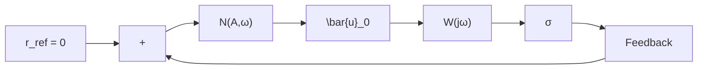

Figure 4 displays the input and output signals of the relaytype controller obtained from the simulations, using $\rho ~ =$ $5 , ~ \mu ~ = ~ 0 . 0 5$ , and the sinusoidal disturbance (3) denoted $\begin{array} { r l r } { f _ { 0 } } & { { } = } & { \eta \cos ( \Omega t ) } \end{array}$ with magnitude $\eta ~ = ~ 1$ and frequency $\Omega \ = \ 2 \ [ \mathrm { r a d / s } ]$ . The key chattering parameters observed in the experiment at steady-state are as follows: fast-oscillations amplitude $A = 0 . 1 5 7 6$ , fast-oscillations period $T = 0 . 3 3 2$ [s], upper-bound of bias component $| \sigma _ { 0 } | = 0 . 0 4 4 7$ , and maximum average control value $| u _ { 0 } | = 0 . 9 8 5 4$ . Accordingly, the fastoscillations frequency is $\omega \ : = \ : 1 8 . 9 2 5$ [rad/s] and the ratios $\Omega / \omega = 0 . 0 5 2 8$ and $\vert \sigma _ { 0 } \vert / A = 0 . 2 8 3 6$ are achieved. The average values of the signals over each fast-oscillations period are computed offline and included for reference. By substituting the parameters listed above into expressions (17)–(18), the following predictions can be made:

(i) The slow component (17) at the output of the relay-type controller is

$$u _ {0} ^ {*} (t) = 0. 9 0 2 8 \cos (t), \tag {21}$$

resulting in a estimation error of 9.15% when compared to the simulation outcome. The maximum value of the average control closely converges to $| u _ { 0 } | \approx | f |$ (see Figure 4, bottom).

flowchart

Fig. 5. Quasi-linearized model for the study of fast motions.

(ii) The control signal is square with a variable duty cycle; approximately 40% when the disturbance reaches its maximum. The fundamental harmonic (18) at the output of the relay-type controller is given by

$$u _ {1} ^ {*} (t) = 6. 3 6 6 \sin (1 8. 9 2 5 t).$$

The Incremental-Input Describing Function [28] (IIDF) of the sign nonlinearity enables modeling the input-output transfer properties of the relay-type controller when driven by an additive sinusoids (14), under the conditions $\Omega \ll$ ω and $| \sigma _ { 0 } | \ \ll \ A$ . The prediction error associated with the bias component (21) remains within a tolerable margin—less than 15%—thus confirming the validity of the DFs (19)–(20) in capturing the steady-state response of the nonlinearity (2) under the given conditions.
