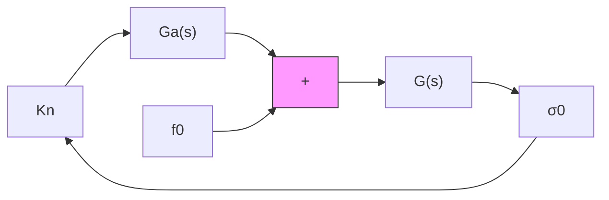

# D. Slow Motions

When the actuation system (4) is static $( \mu ~ = ~ 0 )$ , the tracking error converges to zero in finite time, driven by the SM controller which instantaneously adjusts the control signal in response to disturbances [2]. In practice, however, the control signal is constrained by the bandwidth imposed by actuator dynamics $( \mu > 0 )$ . This limitation gives rise to pulse-width modulation (PWM) behavior [37], wherein the control signal consists of a high-frequency carrier component $u _ { 1 } ^ { * } ( t ) = \overline { { N _ { 1 } } } ( A ) \cdot A \sin ( \omega t )$ and a low-frequency modulator component $u _ { 0 } ^ { * } ( t ) ~ = ~ N _ { i } ( A ) \cdot \sigma _ { 0 } \cos ( \Omega t + \phi )$ . Demodulation—typically implemented via low-pass filtering of the highfrequency control signal—reveals its average influence on the system. This average action, commonly referred to as the equivalent control in the SM literature [3], facilitates the analysis of slow-motion dynamics [37].

The equivalent gain (EG) provides a linear relationship between the average control signal and the bias component, i.e., $u _ { 0 } = K _ { n } \sigma _ { 0 } \approx f _ { 0 }$ . It is defined as the first-order Taylor linearization of the average control function about the origin, where $u _ { 0 } ( 0 ) = 0$ . Accordingly, the EG is given by

$$K _ {n} = \left. \frac {\partial u _ {0}}{\partial \sigma_ {0}} \right| _ {\sigma 0 = 0}. \tag {32}$$

The average control function for the relay-type controller was previously calculated using the linear filter (7), resulting in (13). Therefore, the EG (32) takes the form

$$K _ {n} = \left. \frac {2 \rho}{\pi A \sqrt {1 - \left(\frac {\sigma_ {0}}{A}\right) ^ {2}}} \right| _ {\sigma_ {0} = 0} = \frac {2 \rho}{\pi A}. \tag {33}$$

flowchart

Fig. 7. Linearized model for the study of slow motions.   

line

