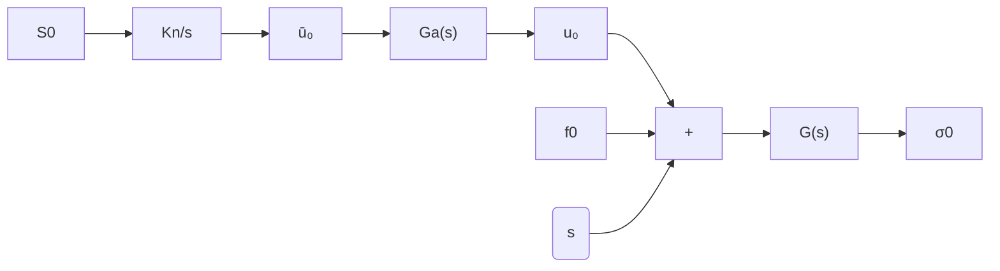

# C. Total Deviation

The total deviation of the sliding variable at steady state can be defined as

$$| \sigma | := \max _ {t _ {r} \ll t \leq T} | \sigma (t) |, \quad T = 2 \pi \left(\frac {1}{\Omega} + \mu\right), \tag {38}$$

where T accounts for both the excitation period associated with the perturbation frequency Ω, as well as the period of the self-excited oscillations corresponding to the characteristic frequency $\omega ^ { * } \approx 1 / \mu$ induced by the actuator dynamics. Within the rectangular region delineated in Remark 7—bounded by $0 . 1 \omega ^ { * }$ in frequency and $2 0 \log ( A ^ { * } ) ~ - ~ 3 . 5 2$ [dB] in magnitude—the coexistence of fast and slow motion components is well justified. In this domain, the application of the DFs (19)–(20) to model both components remains valid. Accordingly, the total deviation (38) of the sliding variable can be conservatively estimated as $| \sigma ^ { * } | \le | \sigma _ { 0 } ^ { * } | + A ^ { * }$ , where $| \sigma _ { 0 } ^ { * } |$ represents the magnitude of slow motions, as predicted by the sensitivity TF (34), and $A ^ { * }$ denotes the amplitude of fast motions given by (27).

Figure 11 presents the total deviation of the sliding variable at steady state, as computed from simulations using the definition in (38), over the frequency range $\Omega \in ( 0 . 0 1 , 1 0 0 )$ [rad/s]. The simulations were carried out with controller parameters $\rho ~ = ~ 5 , ~ \mu ~ = ~ 0 . 0 5$ , and three different magnitudes of the sinusoidal perturbation (3), namely $\eta = 1 , 2 ,$ , and 3. The corresponding theoretical predictions are obtained by evaluating the magnitude of the sensitivity transfer function (34)—with equivalent gain $K _ { n } ~ = ~ \omega ^ { * } ~ = ~ 1 / \mu { \mathrm { - a n d } }$ summing pointwise the amplitude of the self-excited oscillations, given by $A ^ { * } = 2 \rho \mu / \pi .$ . The prediction errors shown in Fig. 11 are valid exclusively within the Low-Frequency band $( \Omega \ : < \ : 0 . 1 / \mu )$ , where the Assumptions 2-3 remain justified. The plots corresponding to the High-Frequency $( 0 . 1 / \mu < \Omega < 1 / \mu )$ and Cutoff-Frequency $( \Omega > 1 / \mu )$ regions are included solely for qualitative illustration.

flowchart

Fig. 12. Linearized model for the study of slow motions.
