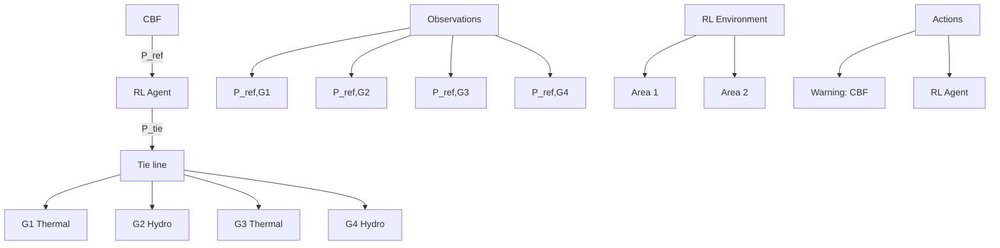

After deployment (in an online setting), the CBF flag can alternatively be followed by reverting to a validated controller or modifying the RL actions using (13) to maintain safety while still receiving dispatch from RL-based AGC.

This paper’s focus is on developing CBFs to facilitate the safe learning of any RL agent and demonstrate their effectiveness in ensuring safety during learning. Therefore, we confine our discussion of the RL agent to the aforementioned details, complemented by the agent’s neural network architecture in Fig. 6 in the appendix. For more details on developing deep RL agents for power system applications, interested readers can refer to [4]. Fig. 1 illustrates the safe training of a RL agent for a two-area power system.

flowchart

Fig. 1. Illustration of CBF-based safe RL in a two-area power system.
