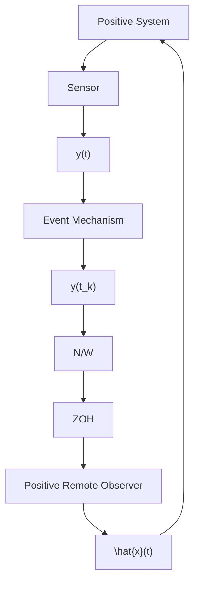

# Preliminaries and Problem formulation

Consider a continuous time linear system as:

$$
\begin{array}{l} \dot {x} (t) = A x (t); \quad x (0) = x _ {0}, \\ \text {(1)} \end{array}
y (t) = C x (t),$$

where system state $\ b { x } ( t ) \in \mathbb { R } ^ { n }$ and output $\ b { y } ( t ) \in \mathbb { R } ^ { r }$ . Matrices A and $C$ are respectively the state and output matrices of the system with proper dimensions. The positivity of the system is defined as follows.

Definition 1. For any initial condition $x _ { 0 } \geq 0$ , the system (1) is defined as positive system if its corresponding trajectory $x ( t ) \geq 0$ and $y ( t ) \geq 0 f o r$ all $t \geq 0$ .

For the continuous-time positive system (1), this work aims to design an event-based positive observer to estimate the state $x ( t )$ . Before formally defining the problem, we first present key definitions and results on positive systems that will be utilized throughout the paper.

Definition 2. A matrix $M \triangleq [ m _ { i j } ] \in \mathbb { R } ^ { n \times n }$ is defined as a Metzler matrix if its off-diagonal elements are non-negative i.e., $m _ { i j } \geq 0 , i \neq j$ .

The checkable condition for the positivity of the system is provided by a classical result Luenberger (1979) as in the following Lemma.

Lemma 1. The system (1) is positive if and only if system matrix A is Metzler and $C \geq 0$ .

Lemma 2. Farina and Rinaldi (2000) For a Metzler matrix A, there always exists a sufficiently large constant $\lambda > 0$ such that $A + \lambda I \ge 0$ .

The result of the asymptotic stability analysis of the positive system (1) is presented as follows.

Lemma 3. Rami and Tadeo (2007) Considering a continuous time positive linear system (1), the following assertions are equivalent:

1. System matrix A is a Hurwitz matrix.   
2. System is asymptotically stable for every non-negative initial conditions.   
3. System is asymptotically stable if and only if there exists a diagonal positive definite matrix D such that $A ^ { \top } D + D A \prec 0 .$ .   
4. There exists a positive λ such that $A ^ { \top } \lambda < 0 .$

Assumption 1. The pair $( A , C )$ is observable and positive system (1) is asymptotically stable.

flowchart

Figure 1. Schematic of the network-based positive state observer for a positive system (1)
