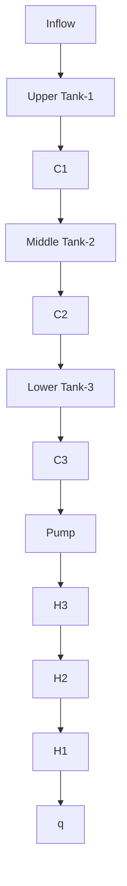

flowchart

text_image

w = 3.5
H₁ₘₐₓ = 35
a = 25
w = 3.5
b = 34.8
H₂ₘₐₓ = 35
c = 10
w = 3.5
R = 36.4
W = 3.5
H₃ₘₐₓ = 35

Figure 6. Multitank configuration

where the matrices A and B are as follows:

$$
A = \left[ \begin{array}{c c c} \frac {- C _ {1} \alpha_ {1}}{\beta (H _ {1}) H _ {1} ^ {1 - \alpha_ {1}}} & 0 & 0 \\ \frac {C _ {1} \alpha_ {1}}{\beta (H _ {2}) H _ {1} ^ {1 - \alpha_ {1}}} & \frac {- C _ {2} \alpha_ {2}}{\beta (H _ {2}) H _ {2} ^ {1 - \alpha_ {2}}} & 0 \\ 0 & \frac {C _ {2} \alpha_ {2}}{\beta (H _ {3}) H _ {2} ^ {1 - \alpha_ {2}}} & \frac {- C _ {3} \alpha_ {3}}{\beta (H _ {3}) H _ {3} ^ {1 - \alpha_ {3}}} \end{array} \right] _ {H = H _ {0}}

B = \left[ \begin{array}{c} \frac {1}{\beta (H _ {1})} \\ 0 \\ 0 \end{array} \right]; \quad C = \left[ \begin{array}{c c c} 0 & 1 & 0 \end{array} \right]
$$

with $h = H - H _ { 0 }$ where $H _ { 0 }$ is the equilibrium state and

$$H _ {i} - \text { fluid level in the } i \text { tank }, i = 1, 2, 3.\alpha_ {i} - \text { flow coefficient of } i \text { tank }C _ {i} - \text { valve coefficient of } i \text { tank }
\begin{array}{l} \beta (H _ {1}): \text { cross - sectional   area   of   Upper   tank - 1 } \\ = a w \\ \end{array}
\beta (H _ {2}): \text { cross - sectional area of Middle tank - 2 }= w \left(c + b \frac {H _ {2}}{H _ {2 _ {\max}}}\right)\beta (H _ {3}): \text { cross - sectional area of Lower tank - 3 }= w \sqrt {R ^ {2} - (H _ {3 _ {\mathrm{max}}} - H _ {3}) ^ {2}}$$

The geometrical and simulation parameters of the tank model are given in Table 2.

Table 2. System Parameters.
