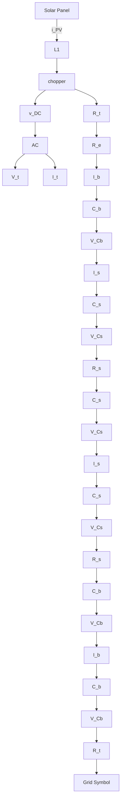
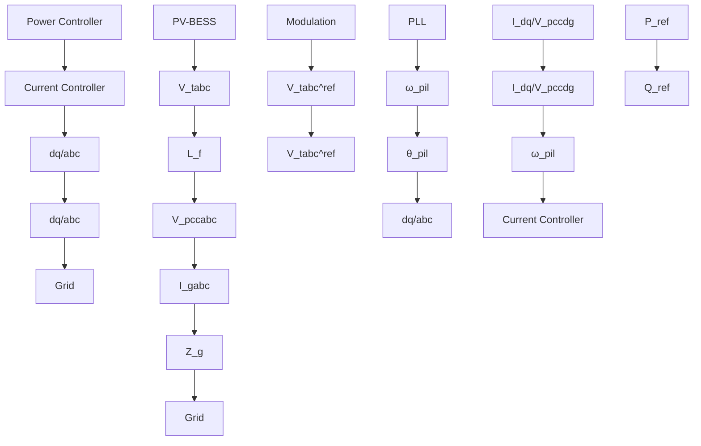

# A. PV–BESS Modeling

The PV–BESS system comprises a photovoltaic array interfaced via a DC-DC boost converter to a shared DC-link, and a battery storage system represented by a nonlinear equivalent circuit connected in parallel to the same DC-link [9] (Fig. 1). Both resources are integrated through a common DC-AC inverter, linking them to the grid through an $L _ { f } { - } C _ { f }$ filter at the point of common coupling (PCC). In this study, a linearized model of the PV–BESS system is employed to facilitate analysis and control design.

flowchart

Fig. 1: Schematic representation of the PV–BESS system model [9].

flowchart

Fig. 2: Controller diagrams of the PV–BESS in GFL modes.
