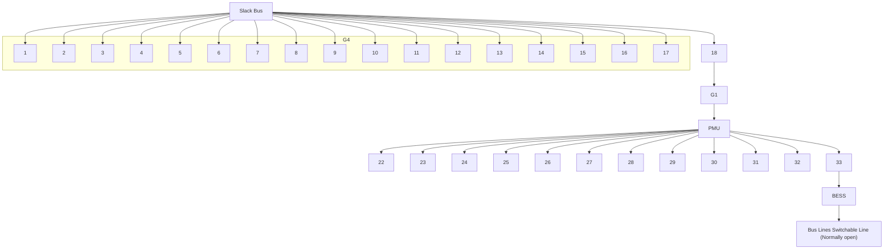

# B. Integration of SHS with Transformer-Based Learning

The following describes how we integrate the SHS framework with Transformer-based learning to enhance real-time contingency detection and classification. The integrated approach leverages both the state outputs and network measurements within the SHS representation, facilitating improved classification accuracy. Specifically, within the detection window interval $[ k \tau , k \tau + \tau _ { 0 } )$ , we utilize the SHS-modeled system states and network outputs, sampled at a high frequency, as input features for the Transformer model. The sampled multivariate time series for the k-th detection interval can be represented as

$$
\mathbf {Z} ^ {(k)} = \left[ \begin{array}{l l l l} \mathbf {z} _ {k, 1} & \mathbf {z} _ {k, 2} & \dots & \mathbf {z} _ {k, S} \end{array} \right] ^ {\top} \in \mathbb {R} ^ {S \times M}, \tag {15}
$$

where $\begin{array} { r } { S = \frac { \tau _ { 0 } } { \Delta t } } \end{array}$ denotes the number of samples collected during the detection window, ∆t is the sampling interval, and each $\mathbf { z } _ { k , t } ~ \in ~ \mathbb { R } ^ { M }$ represents the concatenated system states and output features at time t within the k-th detection interval. This data is processed by the Transformer to classify the system scenario accurately and promptly.

flowchart

Fig. 4: Modified IEEE-33 bus systemt [32].
