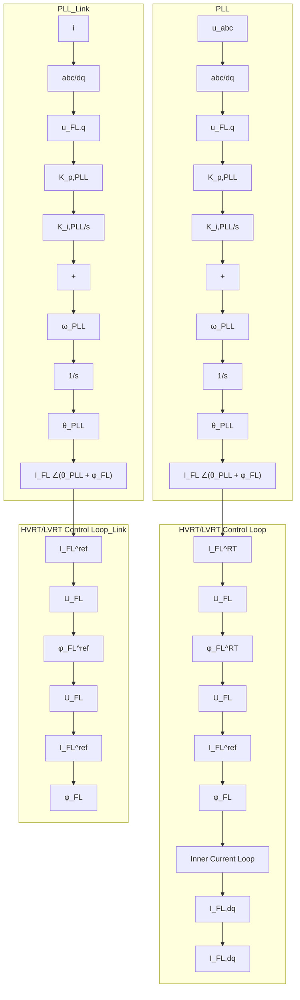

$$
\left\{ \begin{array}{l} I _ {\mathrm{FL}} = \min \left[ K _ {I} ^ {\mathrm{RT}} \left(U _ {\mathrm{FL}} - U _ {\mathrm{FL}} ^ {\mathrm{HV}}\right) + I _ {\mathrm{FL}, 0}, I _ {\mathrm{FL}} ^ {\max} \right] \\ \varphi_ {\mathrm{FL}} = \min \left[ K _ {\varphi} ^ {\mathrm{RT}} \left(U _ {\mathrm{FL}} - U _ {\mathrm{FL}} ^ {\mathrm{HV}}\right) + \varphi_ {\mathrm{FL}, 0}, \frac {\pi}{2} \right] \end{array} \right. \tag {6}
$$

Since there is no fundamental difference among GFL-RESs’ LVRT/HVRT grid code across countries [17], this paper adopts the Chinese grid code as the reference [17], by setting .

flowchart

Fig. 2. Control scheme of GFL-RES with FRT control.
