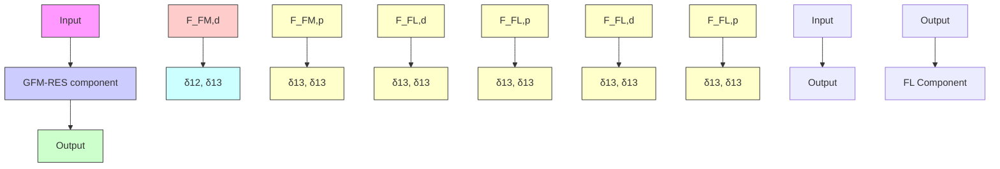

| t [s] | Theoretical value | Simulation result |
| --- | --- | --- |
| 0 | 0 | 0 |
| 1 | 0 | 0 |
| 2 | -3 | 0 |
| 3 | 0 | 0 |
| 4 | 0 | 0 |
| 5 | 0 | 0 |
| 6 | 0 | 0 |

line

| Time (s) | Positive damping effect | Negative damping effect |
| --- | --- | --- |
| 0 | 0 | 0 |
| 1 | 0 | 0 |
| 2 | -1 | 0 |
| 3 | 2 | 2 |
| 4 | 4 | 0 |
| 5 | 0 | 0 |
| 6 | 0 | 2 |

line

| t[s] | f_D12 |
| --- | --- |
| 0 | 1 |
| 1 | 0 |
| 2 | 1 |
| 3 | 0 |
| 4 | 1 |
| 5 | 0 |
| 6 | -1 |

line

| t[s] | v |
| --- | --- |
| 0 | 1 |
| 1 | -1 |
| 2 | 1 |
| 3 | -1 |
| 4 | 1 |
| 5 | -1 |
| 6 | 1 |

line

| t[s] | Damping coefficient |
| --- | --- |
| 0 | -8 |
| 1 | 0 |
| 2 | 2 |
| 3 | -2 |
| 4 | 0 |
| 5 | 2 |
| 6 | -2 |

Fig. 14. Dynamic interaction during transient.

flowchart

Fig. 15. Dynamic coupling between GFM/GFL-RES.
