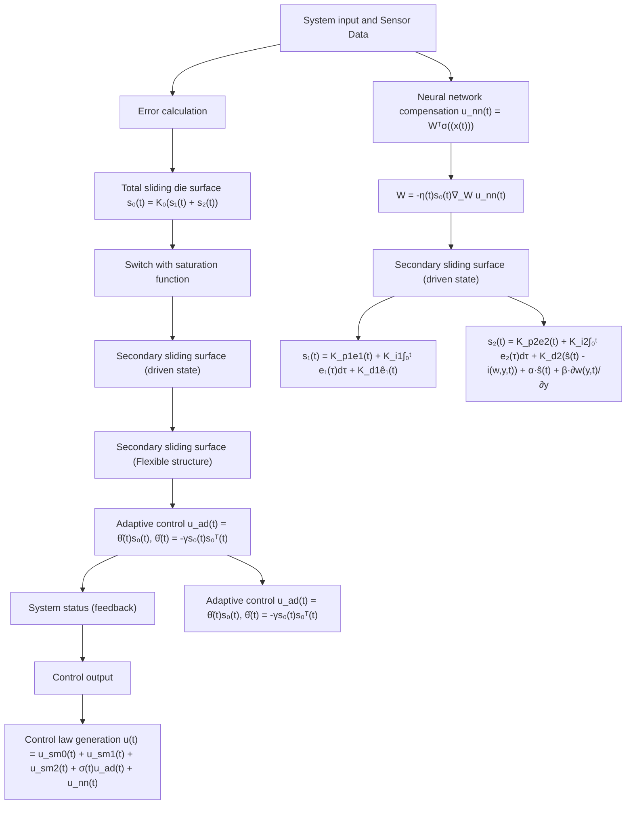

# 3 Controller Design

To achieve control accuracy and global stability in complex marine environments, this section designs a hierarchical sliding mode controller based on a neural network. Due to coupling and nonlinear characteristics, the controller design still needs to handle a large amount of dynamic uncertainty and external disturbances. Therefore, the system is divided into a driving subsystem and a non-driving subsystem, and its control strategy is shown in Fig. 2.

flowchart

Fig. 2: Controller design framework
