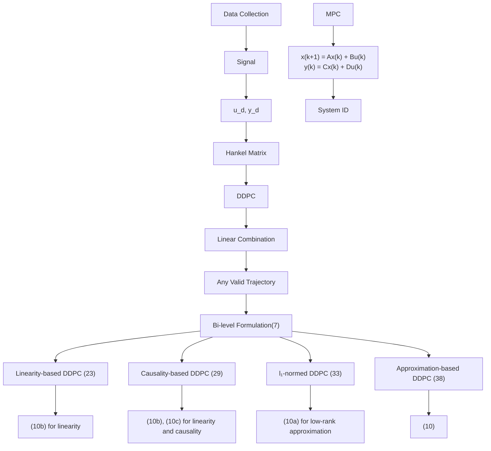

Fig. 1. Schematic of data-driven predictive control (DDPC), which starts by collecting data (usually noisy) from the real system. Indirect methods identify a parametric model, while DDPC forms a Hankel matrix as the trajectory library for predictive control. The bi-level formulation (7) integrates system ID techniques for trajectory library in DDPC. We introduce a series of convex relaxation (23), (29), (33) and an approximation (38) for the bi-level formulation.
