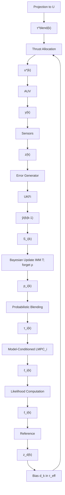

# A. Architecture Overview

Fig 2 illustrates the overall control architecture, which integrates Bayesian mode estimation with LMPC to achieve faulttolerant thrust allocation. A bank of Unscented Kalman Filters (UKFs) runs in parallel, each assuming a different thruster fault model. At each time step a Bayesian estimator fuses the UKF outputs to compute posterior probabilities of each mode. Each hypothesized mode is paired with its own LMPC controller, which is designed based on the corresponding fault model. Crucially, all mode-conditioned LMPC controllers share a common Lyapunov function pair and a shared contraction constraint, so that recursive feasibility and closed-loop stability are guaranteed regardless of which controller is active. Depending on the estimated mode probabilities, the system either selects the controller for the most likely mode (MAP selection) or forms a “soft” blend of the controllers’ outputs weighted by those probabilities.

flowchart

Fig. 2. Bayesian multi-model LMPC architecture.Each model uses the same first-step Lyapunov contraction and amplitude/rate limits, with generalized forces ${ \dot { \boldsymbol { \tau } } } = { \boldsymbol { T } } ( \theta ) { \bf \cal T } { \boldsymbol { u } } .$ . An IMM Bayesian filter computes posterior probabilities for probability-weighted blending of the LMPC outputs.
