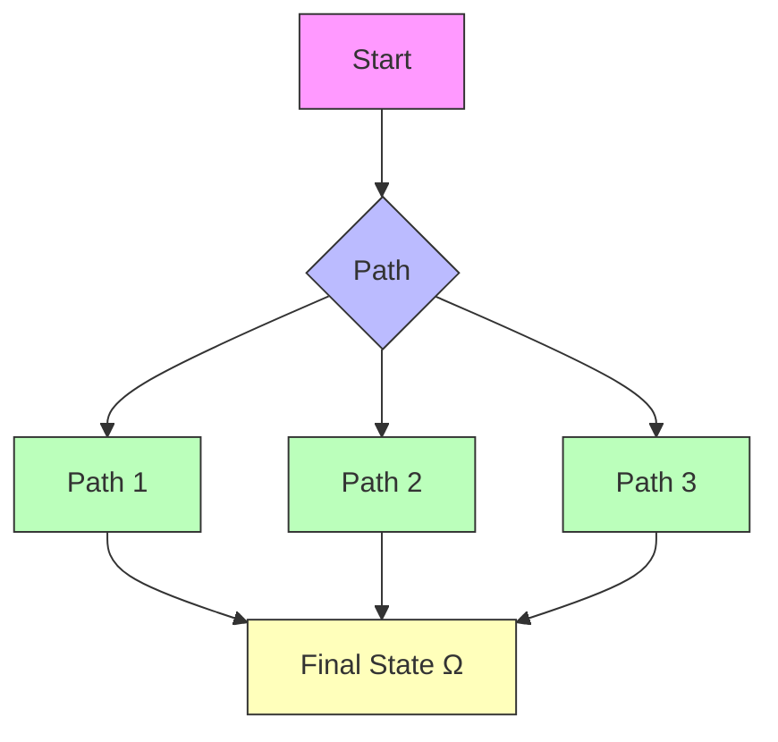

where $\kappa = ( d + 2 ) d P$ is the number of parameters in the model, and $C > 0$ is a constant independent of P .

Obviously, given $\varepsilon > 0$ , taking the width $P _ { \mathrm { ~ ; ~ } }$ , and therefore also $\kappa ,$ large enough, the right-hand side in (3.10) can be made smaller than ε, thus ensuring approximate simultaneous controllability.

The proof of this result proceeds in two steps. First, we construct a smooth and globally Lipschitz timeindependent vector field whose integral curves steer each input point $x _ { i }$ to its corresponding target yi within a fixed time $T$ (assuming the dataset is consistent). The construction of this field is described in Figure 3.3. In the second step, we apply the UAT to approximate the vector field by one generated through a shallow NN [6, 10]. The final output is an approximate simultaneous control result, rather than an exact one, because in the second step, we rely on approximating the vector field.

flowchart

Figure 3.3: From left to right: Construction of a vector field whose integral curves interpolate the dataset, defined in a compact domain Ω containing all the curves.

Two considerations motivate autonomous NODEs. On the one hand, as previously noted and shown in the preceding section, this objective can be met using shallow NNs, which are static models. This suggests that temporal variation in the model is not necessary to achieve the required representational capabilities. On the other hand, it relates to the turnpike principle, whose origins can be traced back to John von Neumann, which ensures that optimal control strategies remain nearly constant over long time periods. We refer to [17], where this principle is applied to designing simpler and more stable architectures for deep ResNets.

To conclude this section, we present briefly some other related results:
