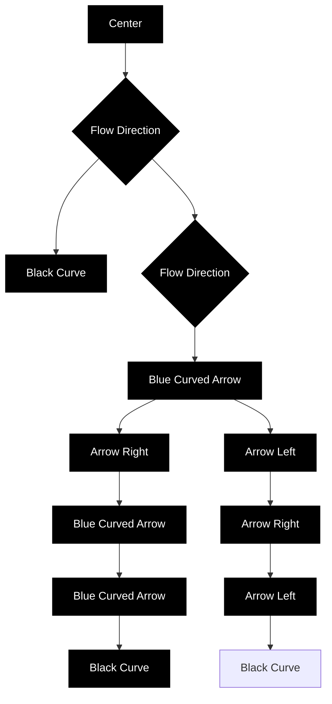

Figure 1. The black line shows a periodic trajectory of the linear switched system defined by the matrices $A _ { 0 } , A _ { 1 }$ considered in section 4. Blue and brown flow lines follow the vector fields defined by $A _ { 0 }$ and $A _ { 1 }$ respectively. The periodic trajectory describes a level curve of the non-strict Lyapunov function $f ,$ and switches between the two vector fields upon crossing the horizontal or vertical axis.

then $f ( x ( t ) )$ is non-increasing, and is constant if and only if the underlying switching law u(t) satisfies $u ( t ) = 0$ for a.e. t such that the two co-ordinates of $x ( t )$ have the same sign, and also satisfies $u ( t ) = 1$ for a.e. t such that the co-ordinates of $x ( t )$ have different signs. A periodic trajectory of this system is shown in Figure 1. This pair of matrices has the property that $A _ { 0 }$ is conjugated to $A _ { 1 }$ by a rotation of $\pi / 2$ , and consequently the periodic trajectory is symmetrical with respect to this rotation. As a consequence of this symmetry, the switching laws corresponding to periodic trajectories consist of two bang intervals of equal duration. Following the construction of Theorem 3 with $\alpha : = { \sqrt { 2 } } .$ , the switched linear system defined by the

four matrices
